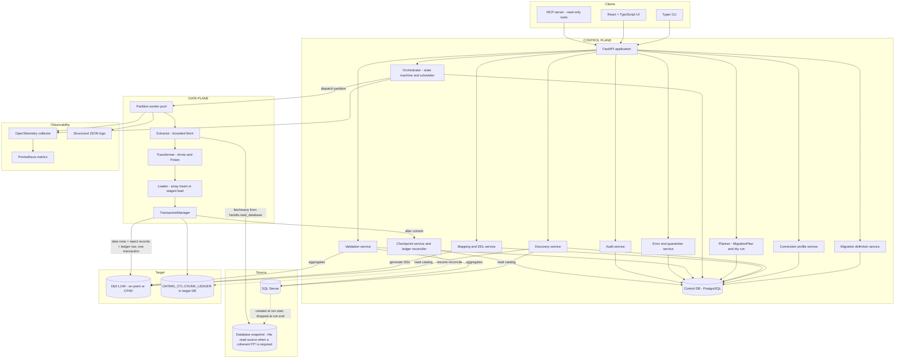
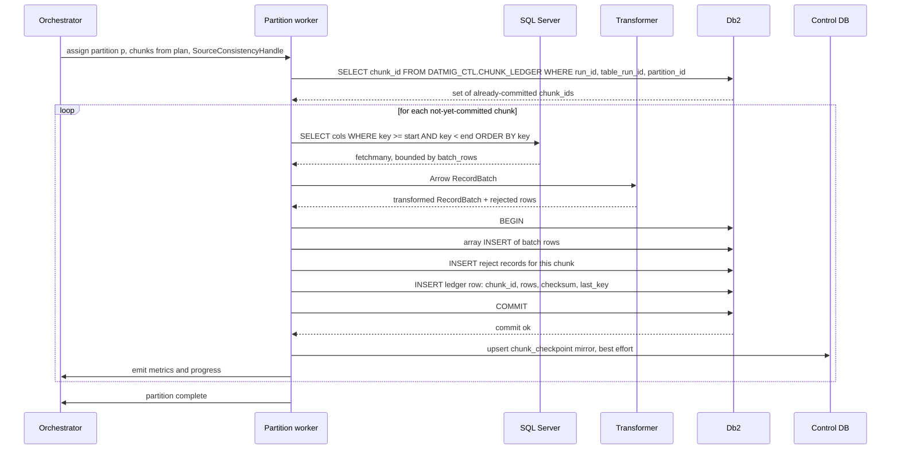
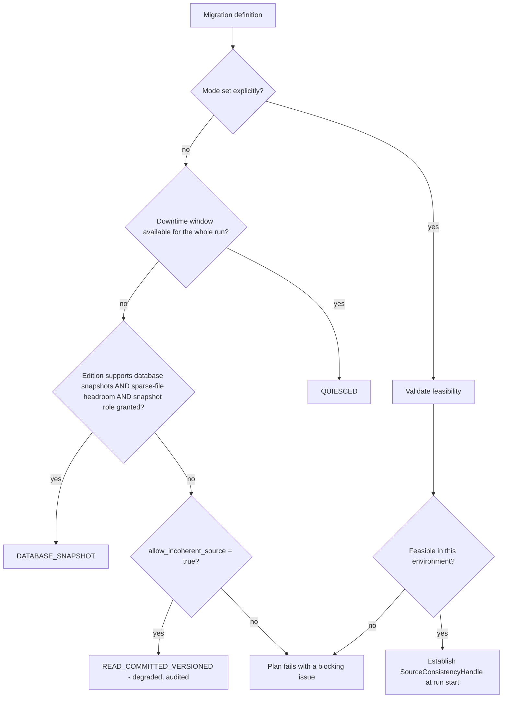
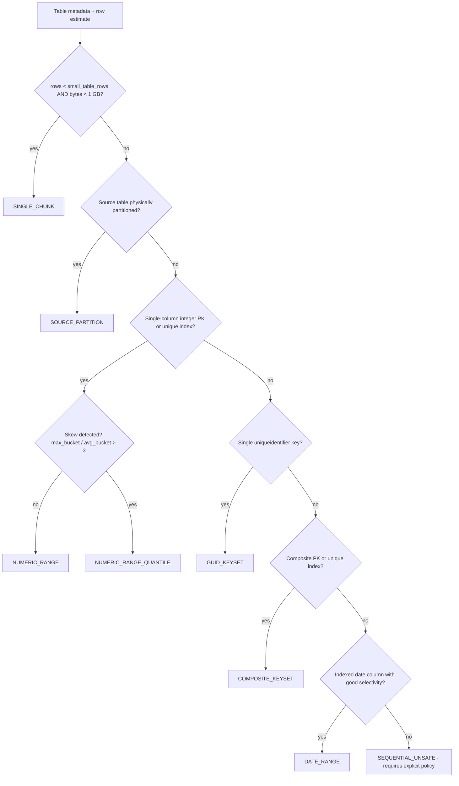
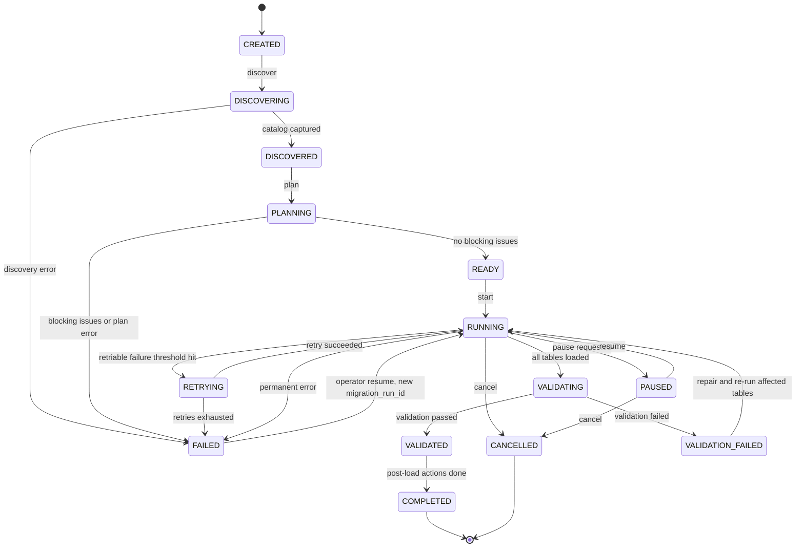
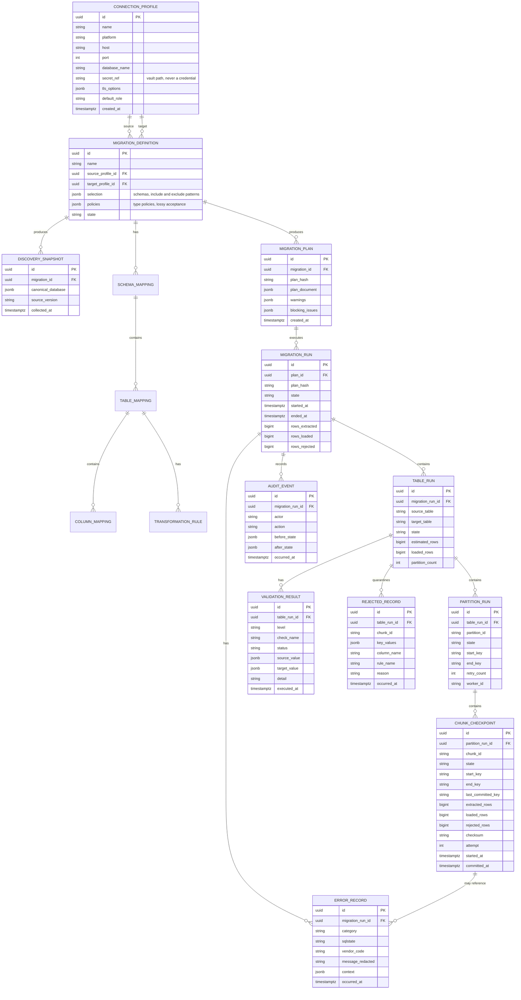

# DATMIG — Phase 0 Architecture and Technical Design

**Status:** Draft for approval
**Scope:** Architecture only. No production implementation in this phase.
**Version:** 0.2 (architecture revision pass)
**Date:** 2026-09-10

> **Revision note (v0.2).** This revision corrects source-consistency reasoning, tightens
> exactly-once terminology, fixes character-type facts, makes reject records atomic with the
> data commit, restates Db2 LOAD semantics in IBM terms, splits the ledger privilege model,
> refines identifier handling, and strengthens the validation digest. The V1 shape is
> unchanged: modular monolith, canonical metadata, bounded-memory Arrow extraction,
> target-resident chunk ledger, array insert default, policy-driven mappings, restricted MCP,
> deterministic plans, PostgreSQL control-plane mirror. See `CHANGELOG-phase0-v0.2.md`.

---

## 0. How to read this document

Statements are tagged:

- **FACT** — verified against vendor documentation or a well-established behaviour. Where verified against IBM docs during this phase, the constraint is noted.
- **ASSUMPTION** — a sensible enterprise default chosen to keep progress moving. Must be confirmed but does not block design.
- **RECOMMENDATION** — the preferred option, with the rejected alternative stated.
- **VERIFY** — depends on your specific SQL Server / Db2 / CP4D version or topology and must be confirmed before implementation of the affected component.

Section 24 contains the consolidated deliverables and the exact first implementation task.

---

## 1. Requirements, assumptions and unknowns

### 1.1 Known requirements (from the brief)

| # | Requirement | Architectural consequence |
|---|---|---|
| R1 | SQL Server → Db2 (on-prem and CP4D) | Two target deployment profiles behind one `TargetConnector` contract |
| R2 | Small DBs → multi-TB | Everything streams; nothing is sized by table size |
| R3 | Schema discovery + conversion + type mapping | Canonical metadata layer is mandatory, not optional |
| R4 | Configurable transformations | Declarative rule engine, decoupled from I/O |
| R5 | Bounded memory | Memory is a function of `batch × row_size × workers`, never row count |
| R6 | Checkpoint / restart / idempotency | Requires an atomic commit boundary shared by data and progress |
| R7 | Validation | First-class subsystem with tiered cost levels |
| R8 | Observability + security | Correlation IDs end-to-end; no secrets in logs; least privilege |
| R9 | Parallelism | Partition is the unit of parallelism; chunk is the unit of commit |
| R10 | Future DB platforms | Engine depends only on protocols, never on `pyodbc`/`ibm_db` types |

### 1.2 Assumptions (chosen defaults — flag any you disagree with)

| ID | Assumption | Why this default | Blast radius if wrong |
|---|---|---|---|
| A1 | Source is SQL Server 2016+ (2019/2022 typical) | `OFFSET/FETCH`, `sys.dm_db_partition_stats`, `STRING_AGG`, `APPROX_COUNT_DISTINCT` availability varies below this | Low — discovery SQL variants |
| A2 | Target is Db2 LUW 11.5.x (not Db2 z/OS, not Db2 for i) | CP4D ships Db2 LUW-family engines | **High** — z/OS changes DDL, LOAD, catalog, and paging entirely |
| A3 | Target Db2 database is Unicode (UTF-8) | Only safe destination for `NVARCHAR` | **High** — drives all character mapping |
| A4 | Target tablespace page size is 32K for wide tables | Db2 max row length is page-size bound | Medium — wide tables fail DDL |
| A5 | DATMIG runs as a single deployable process (API + workers) on Linux, containerised | Distributed execution is premature | Low — boundaries preserved for later split |
| A6 | Control metadata lives in PostgreSQL 16 | Neutral, cheap, transactional, well-supported by SQLAlchemy/Alembic | Low — swappable via SQLAlchemy |
| A7 | Migration mode v1 = **one-shot bulk load into empty or truncatable target tables** | Simplest correct idempotency story | Medium — incremental/CDC changes the loader |
| A8 | Source consistency mode is chosen explicitly per migration. Default `DATABASE_SNAPSHOT` where edition and disk budget allow, otherwise `QUIESCED` | RCSI alone does **not** give thousands of independently executed chunk queries a common point in time — see §6A | **High** — decides whether a coherent point-in-time migration can be claimed at all |
| A9 | DATMIG owns target DDL generation but a DBA approves/applies it | Enterprise reality | Low |
| A10 | Python 3.12 | Best balance of modern typing vs driver wheel availability | Low, but **VERIFY** `ibm_db` wheels for 3.12/3.13 in Phase 1 |
| A11 | FKs, check constraints and non-unique indexes are created **after** bulk load | Order-of-magnitude load speed difference | Low |
| A12 | Network between DATMIG and Db2 is ≥1 Gbps with <20 ms RTT | Round-trip latency dominates array-insert throughput | Medium — changes worker/batch tuning |

### 1.3 Genuine unknowns (do not block design, but must be answered before Phase 5)

- Db2 version/edition and CP4D (or **IBM Software Hub 5.x**) version — see §17.
- Whether `ibm_db` exposes the Db2 CLI LOAD interface from Python (§7.7) — spike required.
- Presence of `uniqueidentifier` PKs, no-PK tables, LOB-heavy tables, `sql_variant`, spatial, `hierarchyid` columns in the real source.
- Largest single table and the allowable migration window.
- Whether DATMIG runs inside the OpenShift cluster or off-cluster.

### 1.4 Decisions that are *environment-dependent* and therefore deliberately deferred

| Decision | Depends on |
|---|---|
| `BOOLEAN` vs `SMALLINT` for `BIT` | Db2 version |
| `TIMESTAMP WITH TIME ZONE` availability on Db2 LUW | **VERIFY** — this type is documented for Db2 for z/OS; Db2 LUW support must be confirmed on your exact version. Default design does not rely on it. |
| `VARBINARY` vs `FOR BIT DATA` | Db2 version |
| `OCTETS` vs `CODEUNITS32` string units | Database `STRING_UNITS` configuration |
| CLI LOAD / external tables vs array insert | Driver capability + CP4D file-system access |
| Direct Db2 port vs OpenShift route/NodePort | Cluster networking policy |

---

## 2. System architecture

### 2.1 Shape

**RECOMMENDATION: modular monolith.** One deployable artifact containing API, CLI, orchestrator and workers, with package boundaries strict enough that the worker pool can later be extracted into its own process or pod without touching the engine. No microservices, no message broker, no Kubernetes Jobs per table in v1.

Why: the hard problems here are correctness (checkpointing, idempotency, type fidelity) and throughput, not service topology. A broker adds a second at-least-once delivery problem on top of the one we already have to solve in the database.

Rejected alternative: Celery/RabbitMQ task-per-chunk. Rejected because chunk dispatch is not the bottleneck, and a broker's retry semantics would duplicate the ledger's job less reliably.

### 2.2 Plane separation

**Control Plane** — knows *what* should happen. Transactional, low-volume, durable. Owns migration definitions, connection profiles, discovered metadata, mappings, plans, run state, validation results, errors, audit.

**Data Plane** — knows *how* rows move. High-volume, memory-bounded, stateless between chunks. Owns extraction, transformation, loading, commit, checkpoint emission.

The critical invariant between them:

> The Data Plane's authoritative progress record — and the authoritative record of any rows it rejected — is written **inside the target Db2 transaction**. The Control Plane holds a mirror of both for querying and reporting. On resume, the target-side ledger wins.

This removes the need for XA/two-phase commit between Db2 and the control database, which is the single most important architectural decision in this document (see §12, ADR-0004 and ADR-0019).

It gives **target atomic chunk commit** unconditionally. It does **not**, by itself, give end-to-end exactly-once migration semantics — that is a strictly stronger claim with five further preconditions, set out in §12.6.

### 2.3 Component diagram



### 2.4 Chunk lifecycle (the core loop)



**Failure between COMMIT and the control-DB mirror write is safe**: the ledger is authoritative and the mirror is rebuilt on resume.

---

## 3. Production technology stack

| Layer | Technology | Purpose | Why selected | Alternative considered | Why not default |
|---|---|---|---|---|---|
| Runtime | **Python 3.12** (`VERIFY` `ibm_db` wheel support) | Backend language | Mandated; mature driver + Arrow ecosystem | Python 3.13 | Driver wheel lag; `ibm_db` historically trails new CPython releases |
| SQL Server driver | **pyodbc** + Microsoft ODBC Driver 18 | Extraction | Best-maintained, supports `fetchmany`, `Encrypt` defaults on | `pymssql` | Thinner feature set, weaker TLS/AAD story |
| Db2 driver | **ibm_db / ibm_db_dbi** | Load + catalog | IBM-supported; `execute_many` array insert; bundles clidriver | Db2 ODBC via pyodbc | Loses IBM-specific connection options; error mapping is poorer |
| Db2 bulk path (optional) | Db2 **CLI LOAD** — `SQL_ATTR_USE_LOAD_API` | High-throughput append | **FACT**: CLI LOAD is a documented CLI interface to the LOAD utility and is significantly faster than array insert for large volumes. **FACT**: it is non-atomic and cannot be rolled back, and row-level errors surface only in a LOAD message file | Array insert | See §7.7 — CLI LOAD is opt-in and staging-table-only because it breaks the transactional checkpoint invariant. **VERIFY** whether `ibm_db` exposes this attribute from Python |
| In-memory batch | **PyArrow RecordBatch** | Canonical in-flight representation | Columnar, zero-copy slicing, explicit typed nulls, predictable memory | Python lists of tuples | 5–10× memory overhead, no type fidelity |
| Transform | **PyArrow compute**, **Polars** for complex ops | Declarative transforms | Vectorised, releases the GIL, Arrow-native | pandas | Higher memory, weaker null/decimal semantics |
| Config | **pydantic-settings** + YAML | Typed config | Validation at load, env-var overlay, secret types | TOML/`configparser` | No validation, no secret handling |
| Control DB | **PostgreSQL 16** + SQLAlchemy 2 + Alembic | Control metadata | Transactional, `JSONB`, advisory locks for leader election, good migrations | SQLite | Fine for dev/POC only; no concurrent writers |
| API | **FastAPI** + uvicorn | REST | Pydantic-native, async, OpenAPI | Flask | Manual validation, no schema generation |
| CLI | **Typer** | Operator interface | Shares pydantic models with API | argparse/click | More boilerplate |
| Frontend | **React 18 + TypeScript + Vite**, TanStack Query | UI | Standard; generated client from OpenAPI | Server-rendered templates | Poor fit for live progress views |
| Logging | **structlog** → JSON | Structured logs | Context binding for correlation IDs | stdlib logging | Manual context plumbing |
| Metrics | **prometheus-client** + OTel metrics | Ops metrics | Standard scrape model | StatsD | Fewer enterprise integrations |
| Tracing | **OpenTelemetry SDK** | Distributed tracing | Mandated; links chunk → span | Jaeger client | Deprecated in favour of OTel |
| Retries | **Tenacity** | Backoff + jitter | Declarative, composable with error taxonomy | Hand-rolled | Reinvention |
| Secrets | **HashiCorp Vault** via a `SecretProvider` port; env vars for dev; K8s secrets in-cluster | Credentials | Pluggable; no vendor lock | Hard-coded provider | Cannot adapt to your standard |
| Testing | **pytest**, `pytest-asyncio`, **testcontainers**, **hypothesis** | Tests | Real engines in integration tests; property tests for type mapping | Mocks only | Type mapping bugs only appear against real engines |
| Packaging | **uv** + `pyproject.toml`, `hatchling` build | Dependency mgmt | Fast, lockfile-based, reproducible | Poetry | Slower; uv is now the pragmatic default |
| Quality | **ruff**, **mypy --strict**, pre-commit | Static analysis | Catches contract drift early | flake8+black+isort | ruff replaces all three |
| Container | **Docker**, multi-stage, distroless-ish slim base | Packaging | Bakes msodbcsql18 + clidriver | Bare venv deploy | Driver installation is the hard part; bake it |
| CI/CD | **GitHub Actions** (`ASSUMPTION`) | Build/test | Assumed; portable to GitLab | Jenkins | Only if you already standardise on it |

**Note on `ibm_db`:** there are publicly reported memory-growth issues with `executemany` on wide tables in some `ibm_db` releases. **RECOMMENDATION**: pin an exact `ibm_db` version, add a Phase 2 soak test that runs 10M rows through the loader while sampling RSS, and treat driver upgrades as requiring re-benchmarking.

---

## 4. Database connector abstractions

Design rule: the engine imports **only** from `datmig.connectors.base`. `pyodbc` and `ibm_db` appear nowhere outside `connectors/sqlserver/` and `connectors/db2/`.

```python
# src/datmig/connectors/base/protocols.py
from __future__ import annotations

from collections.abc import Iterator, Sequence
from contextlib import AbstractContextManager
from typing import Protocol, runtime_checkable

import pyarrow as pa

from datmig.canonical_schema.models import (
    CanonicalColumn, CanonicalDatabase, CanonicalIndex, CanonicalSchema, CanonicalTable,
    ForeignKey, PrimaryKey, TableRef,
)
from datmig.models.chunks import ChunkSpec, KeyValue, LoadOutcome


@runtime_checkable
class Connection(Protocol):
    """A live session. Implementations wrap the vendor handle and never leak it."""

    @property
    def dialect(self) -> str: ...

    def close(self) -> None: ...

    def is_alive(self) -> bool: ...


@runtime_checkable
class ConnectionFactory(Protocol):
    """Creates connections from a resolved profile. Credentials arrive already
    resolved from the SecretProvider; profiles never contain literals."""

    def connect(self, *, read_only: bool = False) -> AbstractContextManager[Connection]: ...

    def test_connection(self) -> "ConnectivityReport": ...


@runtime_checkable
class SchemaInspector(Protocol):
    """Read-only catalog access. Returns canonical models only."""

    def list_databases(self, conn: Connection) -> Sequence[str]: ...
    def list_schemas(self, conn: Connection, database: str | None = None) -> Sequence[CanonicalSchema]: ...
    def list_tables(self, conn: Connection, schema: str) -> Sequence[TableRef]: ...
    def describe_table(self, conn: Connection, ref: TableRef) -> CanonicalTable: ...
    def get_columns(self, conn: Connection, ref: TableRef) -> Sequence[CanonicalColumn]: ...
    def get_primary_key(self, conn: Connection, ref: TableRef) -> PrimaryKey | None: ...
    def get_foreign_keys(self, conn: Connection, ref: TableRef) -> Sequence[ForeignKey]: ...
    def get_indexes(self, conn: Connection, ref: TableRef) -> Sequence[CanonicalIndex]: ...
    def estimate_row_count(self, conn: Connection, ref: TableRef) -> "RowCountEstimate": ...
    def exact_row_count(self, conn: Connection, ref: TableRef, predicate: str | None = None) -> int: ...
    def column_bounds(self, conn: Connection, ref: TableRef, column: str) -> "ColumnBounds": ...
    def quantile_boundaries(
        self, conn: Connection, ref: TableRef, column: str, buckets: int
    ) -> Sequence[KeyValue]: ...


@runtime_checkable
class Extractor(Protocol):
    """Streams one chunk as bounded Arrow RecordBatches.

    Contract:
      * MUST NOT materialise the whole chunk; each yielded batch has
        <= spec.batch_rows rows.
      * MUST apply projection and predicate pushdown server-side.
      * MUST use a deterministic ORDER BY over the partition key so that
        re-execution of the same ChunkSpec yields the identical row set.
      * MUST be safe to call repeatedly for the same ChunkSpec.
    """

    def extract(
        self, conn: Connection, spec: ChunkSpec
    ) -> Iterator[pa.RecordBatch]: ...


@runtime_checkable
class Loader(Protocol):
    """Writes one transformed batch inside a caller-managed transaction.

    Contract:
      * MUST NOT commit. The TransactionManager owns commit.
      * MUST return counts of accepted and rejected rows.
      * MUST surface vendor errors as DatmigError subclasses.
    """

    def prepare(self, conn: Connection, target: CanonicalTable) -> None: ...

    def load_batch(
        self, conn: Connection, target: CanonicalTable, batch: pa.RecordBatch
    ) -> LoadOutcome: ...

    def write_ledger_entry(self, conn: Connection, entry: "LedgerEntry") -> None: ...


@runtime_checkable
class TransactionManager(Protocol):
    """Owns the atomic boundary. `unit` yields a transaction that commits data
    rows AND the ledger entry together, or rolls both back."""

    def unit(self, conn: Connection) -> AbstractContextManager[None]: ...

    def set_isolation(self, conn: Connection, level: "IsolationLevel") -> None: ...


@runtime_checkable
class DDLGenerator(Protocol):
    def create_table_ddl(self, table: CanonicalTable) -> Sequence[str]: ...
    def create_indexes_ddl(self, table: CanonicalTable) -> Sequence[str]: ...
    def create_constraints_ddl(self, table: CanonicalTable) -> Sequence[str]: ...
    def reseed_identity_ddl(self, table: CanonicalTable, next_value: int) -> str: ...
    def quote_identifier(self, name: str) -> str: ...


class SourceConnector(Protocol):
    """Composition root for a source platform."""
    factory: ConnectionFactory
    inspector: SchemaInspector
    extractor: Extractor
    partitioner: "PartitionPlanner"


class TargetConnector(Protocol):
    """Composition root for a target platform."""
    factory: ConnectionFactory
    inspector: SchemaInspector
    loader: Loader
    txn: TransactionManager
    ddl: DDLGenerator
    ledger: "LedgerStore"
```

Adding PostgreSQL or Oracle later means implementing these protocols plus a type-mapping ruleset — no engine change. That is the acceptance test for the abstraction.

---

## 5. Canonical schema model

### 5.1 Translation chain

```
SQL Server catalog                Canonical DATMIG model               Db2 catalog / DDL
(sys.columns, sys.types,   ──▶   CanonicalTable / CanonicalColumn ──▶  CREATE TABLE ...
 sys.indexes, sys.foreign_keys)   + LogicalType (vendor-neutral)        SYSCAT.COLUMNS
```

The middle layer is the contract. Rule: **the canonical model may not contain any field whose name or semantics come from one vendor.** `is_identity` is fine (both platforms have the concept). `is_rowguidcol` is not — it becomes a `vendor_attributes: dict[str, str]` entry that mapping rules may consult but the engine ignores.

### 5.2 Models

```python
# src/datmig/canonical_schema/models.py
from __future__ import annotations

from datetime import datetime
from decimal import Decimal
from enum import StrEnum

from pydantic import BaseModel, ConfigDict, Field


class LogicalType(StrEnum):
    BOOLEAN = "boolean"
    INT8 = "int8"
    INT16 = "int16"
    INT32 = "int32"
    INT64 = "int64"
    DECIMAL = "decimal"
    FLOAT32 = "float32"
    FLOAT64 = "float64"
    STRING = "string"              # variable length, unicode-capable
    FIXED_STRING = "fixed_string"  # blank-padded
    TEXT = "text"                  # unbounded / LOB character
    BINARY = "binary"
    FIXED_BINARY = "fixed_binary"
    BLOB = "blob"
    DATE = "date"
    TIME = "time"
    TIMESTAMP = "timestamp"        # no zone
    TIMESTAMP_TZ = "timestamp_tz"  # instant + offset
    UUID = "uuid"
    XML = "xml"
    JSON = "json"
    ROW_VERSION = "row_version"
    UNSUPPORTED = "unsupported"


class Fidelity(StrEnum):
    LOSSLESS = "LOSSLESS"
    POTENTIALLY_LOSSY = "POTENTIALLY_LOSSY"
    REQUIRES_POLICY = "REQUIRES_POLICY"
    UNSUPPORTED = "UNSUPPORTED"


class LengthUnit(StrEnum):
    """What the declared length actually counts. An integer alone is ambiguous and
    was the source of several v0.1 mapping errors."""
    OCTETS = "octets"                  # bytes. SQL Server VARCHAR(n), including _UTF8 collations
    UTF16_CODE_UNITS = "utf16_code_units"   # SQL Server NVARCHAR(n): n 2-byte units
    UTF32_CODE_UNITS = "utf32_code_units"   # Db2 CODEUNITS32
    CHARACTERS = "characters"          # abstract; only for platforms that truly count characters


class CanonicalType(BaseModel):
    model_config = ConfigDict(frozen=True)

    logical: LogicalType

    # --- string / binary length, modelled explicitly ---
    length_value: int | None = None
    length_unit: LengthUnit | None = None
    encoding: str | None = None           # source storage encoding: "utf-16le", "utf-8", "cp1252"
    unicode: bool = False                 # can represent the full Unicode repertoire
    source_collation: str | None = None   # e.g. "Latin1_General_100_CI_AS_SC_UTF8"
    max_octets: int | None = None         # derived worst-case storage in the SOURCE encoding
    max_code_points: int | None = None    # derived worst-case distinct Unicode code points

    # --- numeric / temporal ---
    precision: int | None = None
    scale: int | None = None
    fractional_seconds: int | None = None

    is_lob: bool = False
    max_observed_octets: int | None = None    # from profiling; drives LOB downgrade
    max_observed_code_points: int | None = None
    vendor_type_name: str                     # e.g. "nvarchar(200)" — diagnostics only


class IdentitySpec(BaseModel):
    model_config = ConfigDict(frozen=True)
    seed: int = 1
    increment: int = 1
    last_value: int | None = None
    always_generated: bool = False


class DefaultSpec(BaseModel):
    model_config = ConfigDict(frozen=True)
    raw_expression: str                  # source text, e.g. "(getdate())"
    is_translatable: bool = False
    translated_expression: str | None = None
    literal_value: str | None = None


class CanonicalColumn(BaseModel):
    model_config = ConfigDict(frozen=True)

    name: str
    ordinal: int
    type: CanonicalType
    nullable: bool
    default: DefaultSpec | None = None
    identity: IdentitySpec | None = None
    computed_expression: str | None = None
    computed_is_persisted: bool | None = None
    collation: str | None = None
    comment: str | None = None
    vendor_attributes: dict[str, str] = Field(default_factory=dict)


class PrimaryKey(BaseModel):
    model_config = ConfigDict(frozen=True)
    name: str
    columns: tuple[str, ...]
    is_clustered: bool | None = None


class UniqueConstraint(BaseModel):
    model_config = ConfigDict(frozen=True)
    name: str
    columns: tuple[str, ...]


class ForeignKey(BaseModel):
    model_config = ConfigDict(frozen=True)
    name: str
    columns: tuple[str, ...]
    referenced_schema: str
    referenced_table: str
    referenced_columns: tuple[str, ...]
    on_delete: str | None = None
    on_update: str | None = None
    is_enforced: bool = True


class CanonicalIndex(BaseModel):
    model_config = ConfigDict(frozen=True)
    name: str
    columns: tuple[str, ...]
    included_columns: tuple[str, ...] = ()
    is_unique: bool = False
    is_clustered: bool = False
    filter_expression: str | None = None


class TableRef(BaseModel):
    model_config = ConfigDict(frozen=True)
    database: str | None = None
    schema_name: str
    table_name: str

    def qualified(self) -> str:
        return f"{self.schema_name}.{self.table_name}"


class RowCountEstimate(BaseModel):
    model_config = ConfigDict(frozen=True)
    estimated_rows: int
    is_exact: bool
    estimated_bytes: int | None = None
    source: str                      # "sys.dm_db_partition_stats" | "count(*)" | ...
    collected_at: datetime


class CanonicalTable(BaseModel):
    model_config = ConfigDict(frozen=True)

    ref: TableRef
    columns: tuple[CanonicalColumn, ...]
    primary_key: PrimaryKey | None = None
    unique_constraints: tuple[UniqueConstraint, ...] = ()
    foreign_keys: tuple[ForeignKey, ...] = ()
    indexes: tuple[CanonicalIndex, ...] = ()
    row_estimate: RowCountEstimate | None = None
    comment: str | None = None
    vendor_attributes: dict[str, str] = Field(default_factory=dict)


class CanonicalSchema(BaseModel):
    model_config = ConfigDict(frozen=True)
    name: str
    tables: tuple[CanonicalTable, ...] = ()
    owner: str | None = None


class CanonicalDatabase(BaseModel):
    model_config = ConfigDict(frozen=True)
    name: str
    platform: str                    # "sqlserver" | "db2"
    version: str
    collation: str | None = None
    encoding: str | None = None
    schemas: tuple[CanonicalSchema, ...] = ()
    discovered_at: datetime
```

### 5.3 Discovery sources

| Concept | SQL Server | Db2 LUW |
|---|---|---|
| Columns | `sys.columns` + `sys.types` + `sys.default_constraints` + `sys.computed_columns` | `SYSCAT.COLUMNS` |
| Tables | `sys.tables` + `sys.schemas` | `SYSCAT.TABLES` |
| PK / unique | `sys.key_constraints`, `sys.index_columns` | `SYSCAT.TABCONST` + `SYSCAT.KEYCOLUSE` |
| FK | `sys.foreign_keys`, `sys.foreign_key_columns` | `SYSCAT.REFERENCES` |
| Indexes | `sys.indexes`, `sys.index_columns` | `SYSCAT.INDEXES`, `SYSCAT.INDEXCOLUSE` |
| Row estimate | `sys.dm_db_partition_stats` (`index_id IN (0,1)`) — cheap, approximate | `SYSCAT.TABLES.CARD` (stale unless RUNSTATS) |
| Exact count | `SELECT COUNT_BIG(*)` | `SELECT COUNT(*)` |

**RECOMMENDATION**: use catalog views, not `INFORMATION_SCHEMA`. `INFORMATION_SCHEMA` loses identity, computed, filtered-index and precision detail on SQL Server.

**RECOMMENDATION**: during discovery, optionally profile character/binary columns with `MAX(DATALENGTH(col))` on a sample. This single measurement decides whether `NVARCHAR(MAX)` can become a `VARCHAR(n)` instead of a `CLOB`, which is frequently a 5–20× load throughput difference.

---

## 6. Datatype mapping engine

### 6.1 Design

Mapping is a **rule table plus a policy set**, not a `dict` and not `if/elif`. Each rule is:

```python
class TypeMappingRule(BaseModel):
    source_type: str                      # "nvarchar"
    predicate: str | None = None          # "length == -1"  (MAX)
    canonical: LogicalType
    target_template: str                  # "CLOB({bytes})"
    fidelity: Fidelity
    policy_key: str | None = None         # e.g. "lob_strategy"
    notes: str
```

Resolution: `source column → (rules matched, most specific wins) → CanonicalType → target rule for dialect+version → target DDL fragment + Fidelity`.

Enforcement rule: **any column resolving to `REQUIRES_POLICY` without an explicit policy value in configuration fails the plan.** `POTENTIALLY_LOSSY` produces a plan warning that must be acknowledged (`--accept-lossy` or a config flag) before `READY`. Nothing truncates silently — ever.

### 6.2 Mapping matrix (SQL Server → canonical → Db2 LUW)

Full matrix with rationale is in [`type-mapping-matrix.md`](./type-mapping-matrix.md). Summary of the decisions that matter:

| SQL Server | Canonical | Db2 default | Fidelity | Key point |
|---|---|---|---|---|
| `TINYINT` | INT16 | `SMALLINT` | LOSSLESS | SQL Server `TINYINT` is unsigned 0–255; Db2 has no `TINYINT` |
| `BIT` | BOOLEAN | `SMALLINT` (0/1) | LOSSLESS | `BOOLEAN` column type is Db2-version dependent — **VERIFY**; `SMALLINT` is universally safe and indexable |
| `MONEY` | DECIMAL(19,4) | `DECIMAL(19,4)` | LOSSLESS | |
| `DECIMAL(p,s)` p ≤ 31 | DECIMAL | `DECIMAL(p,s)` | LOSSLESS | |
| `DECIMAL(p,s)` p > 31 | DECIMAL | policy | **REQUIRES POLICY** | **FACT**: Db2 LUW `DECIMAL` max precision is 31; SQL Server allows 38. Options: `DECFLOAT(34)` (changes exactness semantics), `VARCHAR(n)`, or fail |
| `VARCHAR(n)` | STRING, `length_unit = OCTETS` | `VARCHAR(m OCTETS)` | LOSSLESS if `m` sized correctly | **FACT**: SQL Server `VARCHAR(n)` declares **n bytes**, including under `_UTF8` collations. `m` depends on the source collation's encoding versus the target's, not on a blanket ×4. See the matrix |
| `NVARCHAR(n)` | STRING unicode, `length_unit = UTF16_CODE_UNITS` | `VARCHAR(n CODEUNITS32)` or `VARCHAR(3n OCTETS)` | LOSSLESS by **widening** | **FACT**: `n` counts UTF-16 code units, not characters — a supplementary character consumes two. `VARCHAR(n CODEUNITS32)` safely contains every legal value but permits strings the source could not hold, so this is a *widening*, not a semantic equivalence |
| `CHAR(n)` n ≤ 255 | FIXED_STRING | `CHAR(n)` | LOSSLESS | **FACT**: current Db2 LUW `CHAR` max is **255 OCTETS / 63 CODEUNITS32** (Db2 10.5 documented 254 — **VERIFY** against your version). Larger → `VARCHAR` |
| `VARCHAR(MAX)` / `TEXT` | TEXT | `CLOB(2G)` or downgraded `VARCHAR` | REQUIRES POLICY | Downgrade only if profiled max length proves it safe |
| `DATE` | DATE | `DATE` | LOSSLESS | |
| `TIME(0)` | TIME | `TIME` | LOSSLESS | |
| `TIME(1-7)` | TIME | policy | **REQUIRES POLICY** | Db2 `TIME` has no fractional seconds. Recommended policy: `TIMESTAMP(n)` anchored to `0001-01-01` |
| `DATETIME` | TIMESTAMP(3) | `TIMESTAMP(3)` | LOSSLESS | 3.33 ms granularity preserved in ms |
| `SMALLDATETIME` | TIMESTAMP(0) | `TIMESTAMP(0)` | LOSSLESS | |
| `DATETIME2(n)` | TIMESTAMP(n) | `TIMESTAMP(n)` | LOSSLESS | Db2 supports fractional precision 0–12 |
| `DATETIMEOFFSET(n)` | TIMESTAMP_TZ | `TIMESTAMP(n)` UTC + `SMALLINT` offset column | **REQUIRES POLICY** | Default policy preserves the offset in a sidecar column. `TIMESTAMP WITH TIME ZONE` on Db2 LUW must be **VERIFIED** before being offered |
| `UNIQUEIDENTIFIER` | UUID | `CHAR(36)` canonical text | LOSSLESS | Alternative `CHAR(16) FOR BIT DATA` saves 20 bytes/row but needs a fixed byte-order convention |
| `BINARY(n)` / `VARBINARY(n)` n ≤ 32672 | BINARY | `VARBINARY(n)` or `VARCHAR(n) FOR BIT DATA` | LOSSLESS | Which form is available is Db2-version dependent |
| `VARBINARY(MAX)` / `IMAGE` | BLOB | `BLOB(2G)` | LOSSLESS | Throughput cost is severe; profile and downgrade where possible |
| `XML` | XML | Db2 `XML` if enabled, else `CLOB` | REQUIRES POLICY | Db2 `XML` has load/utility restrictions |
| `ROWVERSION` / `TIMESTAMP` | ROW_VERSION | excluded by default | **REQUIRES POLICY** | Value is meaningless in Db2. Options: exclude, or retain as `CHAR(8) FOR BIT DATA` for audit. Also usable as a delta-detection key |
| `sql_variant`, `hierarchyid`, `geography`, `geometry` | UNSUPPORTED | — | **UNSUPPORTED** | Plan fails unless explicitly excluded or given a custom transform |

### 6.3 Identity and computed columns

- **Identity** → `GENERATED BY DEFAULT AS IDENTITY`, not `GENERATED ALWAYS`. This lets the loader insert the source values directly without `OVERRIDING SYSTEM VALUE`. After the table completes, DATMIG issues `ALTER TABLE ... ALTER COLUMN ... RESTART WITH <max+1>`. This step is part of the table's definition of done and is recorded in the audit log.
- **Persisted computed columns** → default: materialise as a regular column and copy the value (safest, always correct). Optional: `GENERATED ALWAYS AS (expr)` when the expression is in the translatable-function allowlist.
- **Non-persisted computed columns** → default: exclude from the target with a warning, since the value is derivable.


---

## 6A. Source consistency and point-in-time correctness

### 6A.1 Why this needs its own model

**FACT.** SQL Server's `READ_COMMITTED_SNAPSHOT` (RCSI) provides *statement-level* read consistency: each statement sees the committed state as of the moment that statement began. A multi-terabyte migration issues tens of thousands of chunk queries over many hours. Under RCSI each one observes a **different** point in time. RCSI removes reader/writer blocking; it does not create a common snapshot.

**FACT.** SQL Server provides no mechanism to export a snapshot-isolation view from one session and adopt it in another — there is no equivalent of PostgreSQL's `pg_export_snapshot`. Therefore N parallel workers running under `SNAPSHOT` isolation hold N *independent* snapshots established at N different moments. **On SQL Server, parallel workers and a single transaction-scoped snapshot are mutually exclusive.** This is the finding that makes `SNAPSHOT_TRANSACTION` far weaker than it first appears.

**FACT.** A SQL Server **database snapshot** (`CREATE DATABASE ... AS SNAPSHOT OF ...`) is a read-only, static view of the source, transactionally consistent as of the moment of creation minus uncommitted transactions. It is a separate database on the same instance, so **every** worker connection can read the same point in time concurrently. It is available in all editions from SQL Server 2016 SP1 (Enterprise-only before that), is backed by NTFS sparse files, and is maintained by copy-on-write of source pages.

Consequence: point-in-time coherence is a property of the **source read strategy**, not of the checkpoint design. ADR-0004 gives atomic chunk commit whatever the source does; it cannot give point-in-time coherence.

### 6A.2 The model

```python
class SourceConsistencyMode(StrEnum):
    QUIESCED = "QUIESCED"
    DATABASE_SNAPSHOT = "DATABASE_SNAPSHOT"
    SNAPSHOT_TRANSACTION = "SNAPSHOT_TRANSACTION"
    READ_COMMITTED_VERSIONED = "READ_COMMITTED_VERSIONED"
    CDC_RECONCILED = "CDC_RECONCILED"


class SourceConsistencyHandle(BaseModel):
    """Established once per migration run, persisted with the run, passed to every worker."""
    model_config = ConfigDict(frozen=True)

    mode: SourceConsistencyMode
    established_at: datetime
    read_database: str                 # snapshot DB name, or the source DB name
    watermark: str | None              # LSN, rowversion high-water mark, or snapshot name
    coherent_point_in_time: bool       # may DATMIG claim a single PIT?
    parallel_safe: bool                # may >1 worker read concurrently under this mode?
    degraded_reason: str | None
```

Workers read from `handle.read_database`, never from the configured source database name. That single indirection is what lets `DATABASE_SNAPSHOT` work without any change to extraction code.

### 6A.3 The modes

#### QUIESCED

- **Consistency guarantee.** Absolute. No writer exists, so every chunk query at any time observes the same state. Single point in time by construction.
- **Operational requirements.** Application downtime, or `ALTER DATABASE ... SET READ_ONLY`, or a restored backup / detached copy / secondary replica dedicated to the migration. Needs a maintenance window sized to the whole migration.
- **Impact on SQL Server.** Read-only load only. No versioning overhead, no copy-on-write, no `tempdb` pressure. Lowest-impact mode by a wide margin.
- **Parallel workers.** Fully compatible. Any worker count.
- **tempdb / version store.** None.
- **Retry semantics.** A retried chunk re-reads byte-identical data. Digests are reproducible across attempts.
- **Validation.** Full equality validation is meaningful at every level, including `FULL`.

#### DATABASE_SNAPSHOT — **recommended default**

- **Consistency guarantee.** Single database-wide point in time, shared by all readers. Uncommitted transactions at creation are excluded.
- **Operational requirements.** SQL Server 2016 SP1+ for non-Enterprise editions; NTFS volume with headroom for the sparse files; `CREATE DATABASE` permission to create it (an elevated, separate role — see §18.1); the snapshot must be dropped at the end of the run. While it exists the source database cannot be dropped, detached or restored. Sparse files must not run out of space, or the snapshot becomes suspect and must be discarded, failing the run.
- **Impact on SQL Server.** Copy-on-write I/O on the source for every page updated during the migration's lifetime. On a write-heavy OLTP source over a long window this is a real and measurable penalty, and sparse-file growth is proportional to the *write churn*, not to the database size. Must be sized with the DBA.
- **Parallel workers.** Fully compatible — this is the only mode that gives both a single PIT and unrestricted parallelism.
- **tempdb / version store.** None. Cost lands on the source data volume instead of `tempdb`.
- **Retry semantics.** A retried chunk re-reads identical data for as long as the snapshot exists. Digests reproducible.
- **Validation.** Count and aggregate equality against the snapshot is meaningful and exact. Validation queries must target the snapshot, not the live source — DATMIG enforces this by always using `handle.read_database`.

#### SNAPSHOT_TRANSACTION

- **Consistency guarantee.** One point in time **per connection**, established when that transaction's first read executes. With W workers there are W distinct points in time. Only with `worker_count = 1` and a single long-lived transaction does this approximate a coherent PIT — and then only for as long as that one transaction survives.
- **Operational requirements.** `ALLOW_SNAPSHOT_ISOLATION ON`; a long-lived explicit transaction per reader; DDL on read objects is blocked for its duration.
- **Impact on SQL Server.** Row versioning overhead on all writers to the source. Long-lived snapshot transactions prevent version-store cleanup and can block log truncation.
- **Parallel workers.** Technically compatible, semantically useless — each worker gets its own PIT.
- **tempdb / version store.** Serious. The version store must retain every version created since the oldest active snapshot transaction began. A 12-hour reader can grow `tempdb` without bound on a busy source. This is the mode most likely to cause a production incident.
- **Retry semantics.** If the transaction is lost (connection drop, version-store failure, `SQL 3960` update-conflict class errors), the retried chunk reads from a *new* point in time. Digests are not reproducible across the break.
- **Validation.** Count equality is meaningful only against the same connection's snapshot, which no longer exists at validation time. Effectively downgrades validation to expectation-based.
- **Verdict.** Offered for completeness and for small single-worker tables. Not recommended for multi-terabyte work.

#### READ_COMMITTED_VERSIONED (RCSI)

- **Consistency guarantee.** Statement-level only. Thousands of distinct points in time. **No** database-wide PIT. Rows inserted mid-migration may or may not appear depending on chunk ordering; rows deleted mid-migration may be missed; rows updated mid-migration may be captured in either state.
- **Operational requirements.** `READ_COMMITTED_SNAPSHOT ON`. Nothing else.
- **Impact on SQL Server.** Row-versioning overhead on writers; no reader blocking. Lowest disruption of the online modes.
- **Parallel workers.** Fully compatible.
- **tempdb / version store.** Moderate and bounded, because DATMIG's chunk queries are short-lived.
- **Retry semantics.** A retried chunk may legitimately return a *different* row set from its first attempt. The ledger still prevents duplicate commits, but the "same chunk re-selects the same rows" property is lost, so cross-attempt digest comparison is invalid.
- **Validation.** Source/target count equality is not a valid check — a mismatch may mean correct behaviour. Validation must degrade to expectation-based (target count equals summed ledger `loaded_rows`) plus structural checks.
- **Verdict.** Permitted only with `allow_incoherent_source: true`. Selecting it explicitly disables the point-in-time and exactly-once claims and stamps the run's audit record accordingly.

#### CDC_RECONCILED

- **Consistency guarantee.** Eventual convergence to a chosen LSN. Phase 1 does a bulk load under any of the above modes; phase 2 applies the change stream captured from that read point forward; the migration is coherent as of the **cutover LSN**, not as of the bulk-load start.
- **Operational requirements.** CDC or Change Tracking enabled on the source (requires SQL Server Agent for CDC), retention sized to exceed the bulk-load duration, a PK on every table, and a `MERGE`-capable target loader (`STAGED_MERGE`). Substantially more moving parts.
- **Impact on SQL Server.** Capture-job overhead on the source; CDC change tables grow with write volume and retention.
- **Parallel workers.** Compatible for the bulk phase. The apply phase must respect per-key ordering, so it parallelises by key range, not arbitrarily.
- **tempdb / version store.** No additional pressure beyond the bulk-phase mode.
- **Retry semantics.** Apply is idempotent through `MERGE` keyed on the PK plus an LSN high-water mark per table. Re-applying a change range is safe.
- **Validation.** Meaningful only after the stream is quiesced at the cutover LSN, at which point full equality validation applies.
- **Verdict.** The right answer for near-zero-downtime cutover of a live system. **Out of scope for V1**; the model reserves the enum value and the `watermark` field so it can be added without reshaping the run record.

### 6A.4 Which modes support the point-in-time claim

| Mode | Single database-wide PIT | Parallel-safe | Cross-attempt reproducible reads | Equality validation valid | May support end-to-end exactly-once (§12.6) |
|---|---|---|---|---|---|
| `QUIESCED` | Yes | Yes | Yes | Yes | **Yes** |
| `DATABASE_SNAPSHOT` | Yes | Yes | Yes | Yes | **Yes** |
| `SNAPSHOT_TRANSACTION` | Only with 1 worker, 1 unbroken transaction | No (semantically) | No, if the transaction breaks | Weak | Only in the degenerate single-worker case |
| `READ_COMMITTED_VERSIONED` | **No** | Yes | **No** | **No** | **No** |
| `CDC_RECONCILED` | At the cutover LSN | Yes | Yes, per phase | Yes, post-cutover | Yes, with per-key idempotent apply |

**DATMIG may describe a migration as point-in-time coherent only under `QUIESCED`, `DATABASE_SNAPSHOT`, or `CDC_RECONCILED` after cutover.** Under the other modes the run record, the validation report and the CLI output all state the degradation explicitly. Nothing about this is left to the operator's memory.

### 6A.5 Selection and enforcement



Enforcement points:

1. **Plan time.** The planner checks feasibility (edition, `ALLOW_SNAPSHOT_ISOLATION`, RCSI state, permissions) and records the intended mode in the plan. An infeasible mode is a blocking issue, not a warning.
2. **Run start.** The orchestrator establishes the handle — creating the database snapshot if required — before dispatching any worker, and persists it on the `migration_run`. If establishment fails, the run does not start.
3. **Per chunk.** Workers read `handle.read_database`. There is no code path that reads the live source when a snapshot is in force.
4. **Resume.** A resumed run under `QUIESCED` or `DATABASE_SNAPSHOT` **must** re-establish the same read source. If the database snapshot was dropped between runs, the original point in time is gone; DATMIG refuses to resume with a coherent-PIT claim and requires either a new snapshot plus a full re-run of incomplete tables, or explicit acceptance of degradation. Silently resuming against a newer snapshot would produce a torn dataset.
5. **Run end.** The snapshot is dropped as a `post_run_action`, with a retry and an alert if the drop fails — an orphaned database snapshot is an operational hazard that grows.

---

## 7. Large-table migration engine

### 7.1 The memory contract

```
peak_bytes ≈ workers × prefetch_depth × batch_rows × avg_row_bytes × arrow_overhead
```

`arrow_overhead` ≈ 1.2–1.6 for fixed-width columns, higher for many small strings. Nothing in the formula references table size, and that is the property every code review checks.

Worked example: 8 workers × prefetch 2 × 50,000 rows × 400 bytes × 1.4 ≈ **2.2 GB**. Same figure for a 10 GB table and a 10 TB table.

The engine enforces this with a global `MemoryGovernor` that computes `batch_rows` from a configured byte budget and the table's average row width, rather than trusting a hand-set row count:

```python
batch_rows = clamp(
    byte_budget_per_batch // max(avg_row_bytes, 1),
    min_batch_rows,       # default 1_000
    max_batch_rows,       # default 200_000
)
```

Tables with LOB columns get their own, much smaller budget, because a single row can be 100 MB.

### 7.2 Extraction

**FACT / RECOMMENDATION:** use `cursor.fetchmany(n)` with `cursor.arraysize = n`. Never `fetchall()`, never `list(cursor)`, never an unbounded generator that a caller can `list()`.

SQL Server ODBC by default uses a forward-only, read-only, client-buffered cursor. The TDS stream arrives incrementally; `fetchmany` is what keeps the *Python* side bounded. Do **not** switch to server-side/API cursors (`SQL_CURSOR_DYNAMIC` etc.) — they are slower and hold server resources. The correct lever for bounding server-side work is the **WHERE clause**, not the cursor type.

Every extraction query is:

```sql
SELECT <projected, quoted columns>
FROM   <quoted schema>.<quoted table> WITH (READCOMMITTEDLOCK)   -- or NOLOCK only if policy allows
WHERE  <key> >= ? AND <key> < ?          -- half-open, deterministic
  AND  <optional user filter>
ORDER BY <key>;
```

Rules:
1. Half-open ranges `[start, end)` so adjacent chunks can never overlap or gap.
2. `ORDER BY` the partition key always — determinism on retry depends on it.
3. Projection pushdown: only mapped, non-excluded columns.
4. Never `SELECT *`. Never string-concatenated values — identifiers are quoted via the dialect's `quote_identifier`, values are always bound parameters.
5. Avoid `OFFSET/FETCH` when a stable indexed key exists; `OFFSET n` is O(n) on every chunk and turns a linear scan into a quadratic one.

### 7.3 Batch representation

Rows from `fetchmany` are converted straight into a `pa.RecordBatch` with an Arrow schema derived from the canonical model (not inferred). Explicit schema means `NULL` in an all-null chunk does not silently become `null` type, and `Decimal` keeps its precision/scale.

### 7.4 Transformation

Pure function: `RecordBatch → (RecordBatch, RejectedRows)`. No I/O, no connection, no clock reads outside a declared `now()` transform. This makes it unit-testable with zero infrastructure and safely retryable.

### 7.5 Loading

Default loader = **array insert** via `ibm_db_dbi` `executemany` against a prepared `INSERT INTO t (cols) VALUES (?,?,...)`, in batches of `target_batch_rows` (tuned independently of `batch_rows`, typically 5,000–50,000).

### 7.6 Transaction and commit sizing

One chunk = one transaction = one ledger row. Commit interval is bounded by:

- **Db2 transaction log space.** `SQL0964C` (transaction log full) is the classic failure when commit intervals are too large. Log space consumed ≈ rows × row_size × ~1.3.
- **Lock escalation.** Large uncommitted row counts escalate to table locks and serialise workers.
- **Retry cost.** A failed 1M-row transaction wastes 1M rows of work.

**RECOMMENDATION**: default chunk = ~100 MB of data or 250,000 rows, whichever is smaller, tuned per table by the planner. Expose `LOGFILSIZ`/`LOGPRIMARY`-awareness as a documented runbook item rather than trying to auto-detect it.

### 7.7 Db2 LOAD semantics and why array insert remains the default

The V1 decision is unchanged — **array insert is the default loader** — but the reasoning below replaces the earlier shorthand that LOAD is simply "non-rollbackable". The architectural question is narrower and sharper:

> Can the chosen write mechanism participate in a single unit of work that also commits the chunk ledger row and the chunk's reject records?

#### 7.7.1 Regular DML (array insert)

`INSERT` executed through `executemany` is ordinary DML inside the caller's unit of work. It is fully logged, honours `ROLLBACK`, respects isolation and locking, and commits atomically with anything else in the same transaction. **It satisfies the invariant.** Its costs are log volume, lock footprint and round-trip latency.

#### 7.7.2 LOAD utility semantics

**FACT.** The Db2 LOAD utility is not DML. It writes formatted pages and *almost completely eliminates the logging associated with loading data*. It is not part of the caller's unit of work, so a `ROLLBACK` on the connection does not undo it, and it cannot be combined in one transaction with an `INSERT` into the ledger.

**FACT — failure mode is a table state, not a rollback.** A failed LOAD leaves the table in **load pending** state. Access is refused with `SQL0668N` reason code 3 until the operation is either restarted (`LOAD ... RESTART`) or terminated (`LOAD ... TERMINATE`). `LOAD TERMINATE` rolls the interrupted operation back, generally quickly, though it can be delayed when `ALLOW READ ACCESS` and `INDEXING MODE INCREMENTAL` were used. `LOAD_STATUS` in `SYSIBMADM.ADMINTABINFO` reports the state.

**FACT — a worse state exists.** A table becomes **not load restartable** when a rollforward is performed after a failed LOAD that was neither restarted nor terminated, or when a restore is taken from an online backup made while the table was in load-in-progress or load-pending state. Recovery then requires `LOAD TERMINATE` or `LOAD REPLACE`.

#### 7.7.3 Recoverability options

| Option | Behaviour | Consequence for DATMIG |
|---|---|---|
| `COPY YES` | A copy of the loaded data is made so the operation can be recovered by rollforward. Not supported when rollforward recovery is disabled (`logarchmeth1`/`logarchmeth2` `OFF`). | Preserves target recoverability. Costs the copy's I/O and storage, and needs a writable copy destination the Db2 **server** can reach. |
| `COPY NO` | Default when the database is recoverable and no option is given. No copy is made; at completion the table space is left in **backup pending** state. LOAD with `COPY NO` on a recoverable database also uses the load-in-progress *table space* state. | **Unacceptable as a default.** Putting a customer's target table space into backup pending mid-migration blocks access — including index refresh — until a backup is taken. |
| `NONRECOVERABLE` | The load transaction is marked non-recoverable. A subsequent rollforward **skips** it and marks the table *invalid*, ignoring later transactions against it; such a table can then only be dropped or restored from a backup taken after the load completed. Table spaces are not placed in backup pending. Default when the database is not recoverable. | Acceptable **only** for disposable staging objects. Never for a real target table, because it silently removes that table from the target's rollforward recoverability. |

Two further consequences worth stating: LOAD can place tables with constraints into **set integrity pending**, requiring `SET INTEGRITY` afterwards — an additional reason to create constraints after load (ADR-0016); and the LOAD-based paths require either server-reachable files or the CLI/external-table interfaces, which is frequently impossible for a CP4D target reached from off-cluster.

#### 7.7.4 CLI LOAD

**FACT.** The CLI LOAD interface (`SQL_ATTR_USE_LOAD_API` with `SQL_USE_LOAD_INSERT`, `SQL_USE_LOAD_REPLACE`, or the external-table variant) invokes the LOAD utility from a client application rather than from a server-side file, and IBM documents it as yielding significant performance benefits for large inserts. IBM also documents that the insertion is **non-atomic because the load utility precludes atomicity**, that once insertion completes the LOAD and any other statements in the transaction cannot be rolled back, and that row-level errors appear only in the LOAD message file rather than as statement errors.

**VERIFY (Phase 2 spike, ~1 day).** Whether `ibm_db` exposes `SQL_ATTR_USE_LOAD_API` via `ibm_db.set_option`. It does not appear in the publicly documented statement-option list. **V1 must not depend on it.**

#### 7.7.5 Decision

| Mechanism | Participates in the atomic data + ledger + rejects transaction? |
|---|---|
| Array insert (regular DML) | **Yes** |
| LOAD direct to target, any recoverability option | **No** — outside the unit of work; failure yields load pending, not rollback |
| CLI LOAD direct to target | **No** — explicitly non-atomic and non-rollbackable |
| LOAD or CLI LOAD into a **disposable staging table**, then a regular DML `INSERT ... SELECT` + ledger + rejects | **Yes** — the atomic boundary moves to the staging-to-target step |

**RECOMMENDATION (unchanged).** Array insert is the V1 default. The staged path is the only sanctioned way to use any LOAD mechanism, and it is opt-in, benchmark-gated, and subject to these rules:

1. Staging tables live in `DATMIG_STG`, in a table space **dedicated to staging**, so `COPY NO` backup-pending or `NONRECOVERABLE` effects can never touch a table space holding real target data.
2. Staging loads use `NONRECOVERABLE`, which is safe precisely because the staging content is reconstructible from the source by re-running a deterministic chunk.
3. Staging objects are pre-created at bootstrap from the deterministic plan (§18.1), so the runtime account needs no `CREATETAB`.
4. The worker's crash-recovery routine checks `SYSIBMADM.ADMINTABINFO.LOAD_STATUS` for its staging table and issues `LOAD ... TERMINATE` (or drops and recreates it, if permitted) before retrying the chunk. Without this step a crashed staged load leaves a table in load pending and the retry fails with `SQL0668N`.
5. The transactional `INSERT INTO target SELECT FROM staging` plus ledger plus reject rows is what commits. Until that commits, nothing is visible in the target.

### 7.8 Backpressure

**RECOMMENDATION for v1: no cross-stage queues.** Each partition worker runs extract → transform → load → commit synchronously in one thread. Backpressure is then structural: extraction cannot run ahead because the same thread is blocked loading. This eliminates an entire class of unbounded-queue bugs.

Optional (Phase 8, only if benchmarks justify it): a `queue.Queue(maxsize=prefetch_depth)` between extract and load within a worker, giving pipelined overlap while still bounding memory to `prefetch_depth` batches.

Concurrency model: **threads, not processes.** `pyodbc` and `ibm_db` release the GIL during network I/O, and PyArrow releases it during compute, so threads give real parallelism here. Processes are only warranted if custom Python row-level transforms become CPU-bound — at which point the transform stage (and only that stage) moves to a `ProcessPoolExecutor`.

### 7.9 Connection pooling

- Source: one connection per worker, created at partition start, closed at partition end. Do not share cursors across threads.
- Target: one connection per worker with `autocommit = False`.
- Control DB: a small SQLAlchemy pool (`pool_size=5`) — it is not on the hot path.
- Health: `is_alive()` before reuse; on `NETWORK_ERROR`, discard and rebuild rather than reuse.

### 7.10 Pseudocode — the migration loop

```python
def migrate_partition(ctx: WorkerContext, partition: PartitionSpec) -> PartitionResult:
    """Runs in one worker thread. Bounded memory. Safe to re-run from scratch."""
    log = ctx.log.bind(
        migration_id=ctx.migration_id,
        migration_run_id=ctx.run_id,
        table=partition.table_ref.qualified(),
        partition=partition.partition_id,
    )

    # Read source is handle.read_database - the database snapshot when one is in
    # force - never the configured source database name. See 6A.5.
    with ctx.source.factory.connect(
             read_only=True, database=ctx.consistency.read_database
         ) as src, \
         ctx.target.factory.connect() as tgt:

        # 1. Authoritative resume state comes from the TARGET database.
        done: set[str] = ctx.target.ledger.committed_chunk_ids(
            tgt, ctx.run_id, partition.table_run_id, partition.partition_id
        )
        ctx.checkpoint.reconcile_mirror(partition, done)   # heal control DB

        # If a staged LOAD strategy is in use, clear any load-pending staging
        # table left behind by a crash before retrying. See 7.7.5.
        ctx.target.loader.prepare(tgt, partition.target_table)
        ctx.target.loader.recover_staging_if_needed(tgt, partition)

        for chunk in partition.chunks:                     # deterministic, from the plan
            if chunk.chunk_id in done:
                log.debug("chunk.skip.already_committed", chunk_id=chunk.chunk_id)
                ctx.metrics.chunks_skipped.inc()
                continue

            outcome = _run_chunk(ctx, src, tgt, partition, chunk, log)
            ctx.checkpoint.record_mirror(outcome)          # best effort, retriable
            ctx.rejects.record_mirror(outcome)             # best effort, retriable
            ctx.metrics.observe(outcome)

    return PartitionResult.from_chunks(partition)


@retry_on(TransientError, max_attempts=5, backoff="exponential_jitter")
def _run_chunk(ctx, src, tgt, partition, chunk, log) -> ChunkOutcome:
    started = ctx.clock.now()
    extracted = loaded = 0
    digest = ctx.digest_factory.for_chunk(chunk)   # ordered BLAKE3, or keyed multiset
    rejects: list[RejectRecord] = []               # buffered, then written IN the txn
    last_key: KeyValue | None = None

    with ctx.target.txn.unit(tgt):                 # BEGIN ... COMMIT / ROLLBACK
        for raw_batch in ctx.source.extractor.extract(src, chunk):
            extracted += raw_batch.num_rows

            # Transform is pure and deterministic: run-scoped constants are frozen
            # on ctx at run start, so a replay yields identical rows and rejects.
            batch, batch_rejects = ctx.transformer.apply(
                raw_batch, partition.transform_plan, ctx.run_constants
            )
            rejects.extend(
                r.with_seq(len(rejects) + k) for k, r in enumerate(batch_rejects)
            )
            if len(rejects) > ctx.limits.max_reject_rows_per_chunk:
                raise DataError("chunk reject threshold exceeded", chunk_id=chunk.chunk_id)

            digest.update(batch)
            last_key = key_of_last_row(batch, chunk.key_columns)

            result = ctx.target.loader.load_batch(tgt, partition.target_table, batch)
            loaded += result.accepted_rows

            del raw_batch, batch                          # release Arrow buffers promptly

        # 2a. Authoritative reject records join the SAME transaction. See ADR-0019.
        ctx.target.loader.write_reject_records(tgt, chunk, rejects)

        # 2b. The ledger row joins the SAME transaction as the data and the rejects.
        ctx.target.loader.write_ledger_entry(tgt, LedgerEntry(
            migration_run_id=ctx.run_id,
            table_run_id=partition.table_run_id,
            partition_id=partition.partition_id,
            chunk_id=chunk.chunk_id,
            start_key=chunk.start_key,
            end_key=chunk.end_key,
            last_committed_key=last_key,
            extracted_rows=extracted,
            loaded_rows=loaded,
            rejected_rows=len(rejects),
            checksum=digest.hex(),
            digest_algorithm=digest.algorithm_id,
            canonical_encoding_version=digest.encoding_version,
            rejected_digest=reject_digest(rejects),
            attempt=ctx.attempt_number(chunk),
            started_at=started,
            committed_at=ctx.clock.now(),
        ))
    # 3. COMMIT happened here, atomically, for data + rejects + progress.

    log.info("chunk.committed", chunk_id=chunk.chunk_id,
             extracted=extracted, loaded=loaded, rejected=len(rejects),
             duration_ms=ctx.clock.elapsed_ms(started))
    return ChunkOutcome(...)
```

Four properties fall out of this shape:

1. **Bounded memory** — only one `RecordBatch` is live at a time per worker. Reject records are the one unbounded-looking structure, which is why they are capped per chunk.
2. **Target atomic chunk commit** — data, reject records and the ledger entry commit or roll back together (§12.6, ADR-0019).
3. **Deterministic replay** — `chunk` is immutable and came from the plan, so re-running it selects the same rows *provided the source view is stable* (§6A).
4. **Honest claims** — when the source view is not stable, properties 1–3 still hold; only the end-to-end exactly-once claim is withdrawn, and the run records that.

---

## 8. Partitioning engine

A **partition** is a unit of parallelism. A **chunk** is a unit of commit. A partition contains an ordered list of chunks. Both are computed at plan time and persisted, which is what makes retries deterministic.

### 8.1 Strategy catalogue

| Strategy | Applies when | Chunk predicate | Notes |
|---|---|---|---|
| `SINGLE_CHUNK` | rows < `small_table_rows` (default 1,000,000) *and* bytes < 1 GB | none | One worker, one transaction |
| `NUMERIC_RANGE` | single-column integer PK/unique index | `k >= s AND k < e` | Boundaries from `MIN`/`MAX` if dense, from quantiles if sparse/skewed |
| `NUMERIC_RANGE_QUANTILE` | integer key with detected skew or gaps | same | Boundaries from `NTILE`/`PERCENTILE_DISC` over a sample |
| `DATE_RANGE` | clustered/covering index on a date column, append-style data | `d >= s AND d < e` | Natural alignment with source index; good for time-series |
| `GUID_KEYSET` | single `uniqueidentifier` key | `g > last ORDER BY g` | Boundaries **discovered progressively and then persisted** so retries are deterministic |
| `COMPOSITE_KEYSET` | composite PK | `(a > ?) OR (a = ? AND b > ?)` | SQL Server does not support row-value comparison; expansion required |
| `INDEX_KEYSET` | no PK but a unique index exists | as above on that index | Treat the unique index as the key |
| `SOURCE_PARTITION` | source table is physically partitioned | `$PARTITION.fn(col) = n` | Best possible I/O alignment |
| `SEQUENTIAL_UNSAFE` | no unique key at all | `OFFSET/FETCH` over a stable `ORDER BY` | **Requires policy**, single worker, quiesced source — see §8.6 |

### 8.2 Automatic selection



Selection inputs: row estimate, byte estimate, PK/unique index definitions, index clustering, a cheap quantile probe on the candidate key, and any per-table override in configuration. The chosen strategy, the probe results and the reason are all written into the `MigrationPlan` so the operator can see *why*.

### 8.3 Skew handling

Equi-width ranges over a key with gaps (post-purge tables, sharded ID allocation, `IDENTITY` after reseed) produce empty chunks and one monstrous chunk. Detection: sample the key with `NTILE(n)` or `PERCENTILE_DISC` over a `TABLESAMPLE`, compare bucket populations. If `max/avg > skew_threshold` (default 3.0), switch to quantile boundaries. Cost of the probe is one indexed scan of a sample, typically seconds.

### 8.4 GUID keys

SQL Server's `uniqueidentifier` sort order is **not** lexicographic on the textual form — it compares the last six bytes first. That is fine for us as long as we never try to reproduce the ordering outside SQL Server: keyset pagination uses `ORDER BY g` and `WHERE g > @last` and lets SQL Server define the order. The discovered boundary values are persisted in the plan/ledger as the exact byte values, so the same chunk boundaries are reproduced on retry without needing to understand the collation.

Trade-off: GUID keyset chunks cannot all be computed up front for parallelism. **RECOMMENDATION**: run a boundary-discovery pass first (`SELECT g FROM t ORDER BY g OFFSET n ROWS FETCH NEXT 1 ROWS ONLY` at intervals, or a windowed `NTILE` over the index), persist the boundaries, then parallelise. The discovery pass is an index-only scan and is usually cheap relative to the migration.

### 8.5 Composite keys

```sql
WHERE (a > @a) OR (a = @a AND b > @b) OR (a = @a AND b = @b AND c > @c)
ORDER BY a, b, c
```

Verify the index supports this access path; if the plan shows a scan, fall back to `DATE_RANGE` or single-stream.

### 8.6 No usable unique key

This is the honest hard case. Without a stable unique ordering, "rows 1,000,000–1,050,000" is not a well-defined set, so exactly-once cannot be guaranteed if the source changes mid-migration.

Options, in order of preference:

1. **Add a surrogate.** If the DBA permits, add a nullable `BIGINT IDENTITY` or use an existing `ROWVERSION` as a de-facto unique key. Best answer by far.
2. **Quiesce the source, or read from a database snapshot.** Under `QUIESCED` or `DATABASE_SNAPSHOT` (§6A), `OFFSET/FETCH` over a deterministic `ORDER BY <all columns>` is stable because nothing can change underneath it. Requires policy acknowledgement and forces single-stream. Under any online mode this option is invalid, not merely risky.
3. **Full-table-replace semantics.** Truncate target, migrate as one logical unit, and on any failure restart the whole table. Acceptable for small/medium tables only.
4. **Refuse.** Plan fails with a clear message.

**RECOMMENDATION**: default is (4) fail, with (2) and (3) available as explicit per-table policies — and (2) only when the run's `SourceConsistencyMode` provides a stable view. A table migrated under `SEQUENTIAL_UNSAFE` caps the whole run's `SemanticsLevel` at `TARGET_ATOMIC_ONLY` (§12.6), which is reported rather than buried. Silently doing something that might duplicate rows is worse than stopping.

---

## 9. Transformation engine

### 9.1 Model

```
TransformPlan = ordered list of ColumnRules + TableRules
RecordBatch in → RecordBatch out + RejectedRows
```

Execution order is fixed and documented so results are predictable: `exclude → rename → null-handling → trim/string ops → replace → cast → derived → validate`.

Every rule declares an `on_error` behaviour: `fail` (default), `reject_row`, `null`, `default`. `reject_row` sends the row to quarantine with the rule name, the column, the original value (subject to redaction policy) and the chunk ID — it never silently drops it.

Custom Python transforms are loaded from a configured, allowlisted module path, receive a `pa.Array` and must return a `pa.Array` of the declared output type. They run inside the pure transform stage — no DB handles are available to them by construction.

A realistic configuration example is in [`../../config/examples/transformations.example.yaml`](../../config/examples/transformations.example.yaml).

### 9.2 Separation guarantee

`datmig.pipeline.transformation` imports Arrow/Polars and canonical models only. It has no dependency on `connectors`, `checkpoint` or `state`. Enforced by an import-linter rule in CI, not by convention.

---

## 10. Migration planner

### 10.1 MigrationPlan

```python
class LoadStrategy(StrEnum):
    DIRECT_INSERT = "direct_insert"           # array insert straight to target
    STAGED_INSERT_SELECT = "staged_insert"    # staging table, then INSERT..SELECT
    STAGED_MERGE = "staged_merge"             # staging table, then MERGE (re-runnable)
    TRUNCATE_AND_LOAD = "truncate_and_load"


class TablePlan(BaseModel):
    source: TableRef
    target: TableRef
    target_table: CanonicalTable             # post-mapping, post-transform shape
    estimated_rows: int
    estimated_bytes: int
    row_count_source: str
    order_rank: int                          # dependency ordering
    depends_on: tuple[TableRef, ...]
    partition_strategy: PartitionStrategy
    partition_key: tuple[str, ...]
    partitions: tuple[PartitionSpec, ...]    # each with its ordered ChunkSpecs
    extract_batch_rows: int
    target_batch_rows: int
    chunk_rows: int
    worker_count: int
    column_mappings: tuple[ColumnMapping, ...]
    fidelity_warnings: tuple[FidelityWarning, ...]
    transform_plan: TransformPlan
    load_strategy: LoadStrategy
    validation_level: ValidationLevel
    post_load_actions: tuple[str, ...]       # index creation, FK, identity reseed, RUNSTATS


class MigrationPlan(BaseModel):
    plan_id: UUID
    migration_id: UUID
    created_at: datetime
    plan_hash: str                           # of the normalised plan; recorded on every run
    source_profile: ConnectionProfileRef
    target_profile: ConnectionProfileRef
    source_database: CanonicalDatabase
    target_database_name: str
    schemas: tuple[str, ...]
    tables: tuple[TablePlan, ...]
    global_worker_limit: int
    memory_budget_bytes: int
    validation_level: ValidationLevel
    ddl_statements: tuple[str, ...]
    warnings: tuple[PlanWarning, ...]
    blocking_issues: tuple[PlanIssue, ...]   # non-empty ⇒ cannot reach READY
```

`plan_hash` matters: a run is bound to the plan it started with. If the plan changes, the resume path must refuse to continue the old run under the new plan, because chunk boundaries may have moved. This is an easy bug to ship and an expensive one to discover.

### 10.2 Dependency ordering

Topological sort over FK graph. Cycles (self-referencing or mutual FKs) are broken by deferring constraint creation to `post_load_actions` — which is the default anyway, since FKs are created after load. Ordering therefore mostly matters for validation and for optional constraint-enforced loads.

### 10.3 Dry run

`datmig plan --dry-run` produces, without writing a byte of data:

- resolved table list with row/byte estimates and total,
- chosen partition strategy + boundary count per table, with the reason,
- the full type-mapping report: lossless / lossy / requires-policy per column,
- generated target DDL (printed, not executed),
- estimated duration from a configured or previously benchmarked throughput figure,
- peak memory estimate from the §7.1 formula,
- every blocking issue.

Exit code is non-zero if `blocking_issues` is non-empty, so it works in CI.

---

## 11. Migration state machine

### 11.1 Migration-level states



`DISCOVERED` and `VALIDATION_FAILED` are additions to the list in the brief. `DISCOVERED` is needed because discovery output is reusable across many plans; `VALIDATION_FAILED` is needed because "data is loaded but wrong" is operationally very different from "the load failed".

### 11.2 Nested levels

| Level | Entity | States | Owns |
|---|---|---|---|
| Migration | `migration_run` | as above | overall lifecycle |
| Table | `table_run` | `PENDING → DDL_READY → LOADING → LOADED → VALIDATING → VALIDATED / FAILED / SKIPPED` | DDL, post-load actions, table validation |
| Partition | `partition_run` | `PENDING → IN_PROGRESS → COMPLETED / FAILED` | worker assignment, retry count |
| Chunk | `chunk_checkpoint` | `PENDING → IN_FLIGHT → COMMITTED / FAILED / QUARANTINED` | the atomic unit |

Rollup rules: a partition is `COMPLETED` iff every chunk is `COMMITTED`; a table is `LOADED` iff every partition is `COMPLETED`. Rollups are computed, never hand-maintained, so they cannot drift.

Only `COMMITTED` is durable truth, and it is durable because it lives in the target database (§12).

---

## 12. Checkpointing and resume

**This is the section that determines whether DATMIG is trustworthy.**

### 12.1 The problem

Data goes to Db2. Progress traditionally goes to a control database. Two databases, no distributed transaction ⇒ a crash in the gap either loses progress (→ duplicates on resume) or records progress that never committed (→ missing rows). XA across Db2 and PostgreSQL is technically possible and operationally miserable.

### 12.2 The solution: the ledger lives in the target

```sql
-- Created once per target database by the DATMIG_BOOTSTRAP role (see 18.1),
-- never by the runtime service account.
CREATE TABLE DATMIG_CTL.CHUNK_LEDGER (
    MIGRATION_RUN_ID    CHAR(36)      NOT NULL,
    TABLE_RUN_ID        CHAR(36)      NOT NULL,
    PARTITION_ID        VARCHAR(64)   NOT NULL,
    CHUNK_ID            VARCHAR(128)  NOT NULL,
    TARGET_SCHEMA       VARCHAR(128)  NOT NULL,
    TARGET_TABLE        VARCHAR(128)  NOT NULL,
    START_KEY           VARCHAR(512),
    END_KEY             VARCHAR(512),
    LAST_COMMITTED_KEY  VARCHAR(512),
    EXTRACTED_ROWS      BIGINT        NOT NULL,
    LOADED_ROWS         BIGINT        NOT NULL,
    REJECTED_ROWS       BIGINT        NOT NULL DEFAULT 0,
    CHECKSUM            VARCHAR(64),
    ATTEMPT             INTEGER       NOT NULL DEFAULT 1,
    STARTED_AT          TIMESTAMP     NOT NULL,
    COMMITTED_AT        TIMESTAMP     NOT NULL,
    REJECTED_DIGEST     VARCHAR(64),
    DIGEST_ALGORITHM    VARCHAR(32)   NOT NULL,
    CANONICAL_ENCODING_VERSION SMALLINT NOT NULL,
    CONSTRAINT PK_CHUNK_LEDGER PRIMARY KEY
        (MIGRATION_RUN_ID, TABLE_RUN_ID, PARTITION_ID, CHUNK_ID)
);

-- Authoritative reject records. Written in the SAME transaction as the data rows
-- and the ledger row, so rejects can never disagree with what was committed.
-- See ADR-0019.
CREATE TABLE DATMIG_CTL.REJECT_RECORD (
    MIGRATION_RUN_ID    CHAR(36)      NOT NULL,
    TABLE_RUN_ID        CHAR(36)      NOT NULL,
    PARTITION_ID        VARCHAR(64)   NOT NULL,
    CHUNK_ID            VARCHAR(128)  NOT NULL,
    REJECT_SEQ          INTEGER       NOT NULL,   -- deterministic ordinal within the chunk
    SOURCE_KEY          VARCHAR(512),             -- canonical rendering of the PK values
    COLUMN_NAME         VARCHAR(128),
    RULE_NAME           VARCHAR(128),
    REASON_CODE         VARCHAR(64)   NOT NULL,
    REASON_DETAIL       VARCHAR(1024),            -- redaction policy applied before write
    REJECTED_VALUE      VARCHAR(4000),            -- omitted entirely for sensitive columns
    OCCURRED_AT         TIMESTAMP     NOT NULL,
    CONSTRAINT PK_REJECT_RECORD PRIMARY KEY
        (MIGRATION_RUN_ID, TABLE_RUN_ID, PARTITION_ID, CHUNK_ID, REJECT_SEQ)
);
```

`DATMIG_CTL` is created and maintained by a bootstrap role; the runtime account holds `INSERT`/`SELECT` on these two tables and nothing more (§18.1).

### 12.3 Exact commit ordering

```
1.  BEGIN                                   (target connection, autocommit off)
2.  INSERT data rows            (array insert, N batches)
3.  INSERT DATMIG_CTL.CHUNK_LEDGER row      ← same transaction
4.  COMMIT                                  ← the only durable event that matters
5.  UPDATE control DB mirror                ← after commit, best effort, retriable
6.  Emit metrics / logs / trace span end
```

**The checkpoint is never advanced before the target transaction commits, because the checkpoint *is part of* the target transaction.** Step 5 is a cache refresh, not a checkpoint.

Crash analysis:

| Crash point | Db2 state | Ledger | Control DB | Resume behaviour |
|---|---|---|---|---|
| During step 2 | rolled back | no row | stale | chunk re-run from scratch — correct |
| Between 2 and 3 | rolled back | no row | stale | chunk re-run — correct |
| During step 4 (in-doubt) | Db2 resolves atomically | matches data | stale | ledger read decides; whatever Db2 did, data and ledger agree |
| Between 4 and 5 | committed | row present | stale | reconciler rebuilds mirror from ledger; chunk skipped — **no duplicates** |
| After 5 | committed | row present | current | chunk skipped |

There is no window in which data exists without its ledger entry, or vice versa.

### 12.4 Resume algorithm

```python
def resume(migration_id: UUID) -> None:
    run = control.latest_run(migration_id)
    plan = control.plan_for(run.plan_id)
    assert_plan_unchanged(plan.plan_hash, run.plan_hash)   # refuse to resume a mutated plan

    with target.connect() as tgt:
        for table_plan in plan.tables:
            ledger_rows = target.ledger.all_for_table(tgt, run.id, table_plan.table_run_id)
            control.reconcile_table(table_plan, ledger_rows)    # heal the mirror

    dispatch_incomplete_partitions(run, plan)
```

Cost of resume on a 2 TB table that died at 70%: one indexed read of the ledger (tens of thousands of rows at most), then work restarts at the first uncommitted chunk. Nothing is re-extracted, re-transformed or re-loaded.

**A crashed 2 TB migration re-does at most one chunk of work (≤100 MB by default), not 1.4 TB.**

### 12.5 Ledger retention

After a migration reaches `COMPLETED` and validation passes, the ledger for that run is archived into the control DB and optionally dropped from the target. Keep it by default — it is small, and it is the evidence trail an auditor will ask for.

### 12.6 Terminology: what DATMIG may and may not claim

Two claims are routinely conflated. DATMIG keeps them separate in code, documentation, CLI output and audit records.

**Target Atomic Chunk Commit (TACC)** — for every chunk, the data rows, the ledger row and the reject records are committed together or not at all; a committed chunk is never partially present, and a rolled-back chunk leaves no trace. **This holds unconditionally**, under every source consistency mode, at every worker count, for every partitioning strategy. It is what ADR-0004 and ADR-0019 deliver.

**End-to-end exactly-once migration semantics** — every source row that existed at the migration's point in time appears in the target exactly once, transformed deterministically, or appears exactly once in the reject records with a recorded reason. This is a **strictly stronger** claim and requires all six invariants below to hold simultaneously.

| # | Invariant | Delivered by | Fails when |
|---|---|---|---|
| **I1** | **Stable source view** — every chunk query observes one common point in time | `SourceConsistencyMode` ∈ {`QUIESCED`, `DATABASE_SNAPSHOT`}, or `CDC_RECONCILED` after cutover (§6A) | RCSI or per-connection snapshot transactions |
| **I2** | **Immutable plan** — the run is bound to the plan it started with | `plan_hash` recorded on the run; resume refuses on mismatch (ADR-0011) | Plan regenerated between runs |
| **I3** | **Deterministic chunk boundaries** — a `ChunkSpec` re-selects exactly the same row set | Half-open key ranges computed at plan time, persisted, immutable, with `ORDER BY` key | `SEQUENTIAL_UNSAFE` partitioning; discovered-boundary strategies whose boundaries were not persisted |
| **I4** | **Deterministic transformations** — the same input batch yields the same output batch and the same rejects | Pure transform stage; no clock, randomness, environment or mutable external lookup; run-scoped values (`run_started_at`, lookup tables, digest keys) frozen at run start and stored with the run | A custom transform reads the wall clock, a mutable file, or a network service |
| **I5** | **Atomic target data + ledger + rejects** | TACC (ADR-0004, ADR-0019) | A loader that cannot join the unit of work — direct LOAD (§7.7) |
| **I6** | **Idempotent reject handling** — replaying a chunk cannot double-count or lose rejects | Rejects keyed `(run, table, partition, chunk, reject_seq)` and written in the chunk transaction | Rejects written to a side channel after commit |

Derived claims, in increasing strength:

| Claim | Requires | Status |
|---|---|---|
| No partially applied chunk | I5 | Always true |
| No duplicate rows in the target | I2, I3, I5 | True for every supported strategy except `SEQUENTIAL_UNSAFE` |
| No missing rows relative to what was read | I2, I3, I5 | Same |
| Cross-attempt reproducible digests | I1, I3, I4 | Requires a coherent source mode |
| **End-to-end exactly-once** | I1–I6 | Only under `QUIESCED` or `DATABASE_SNAPSHOT`, with a deterministic partitioning strategy and no non-deterministic transforms |
| **Point-in-time coherent migration** | I1 with a database-wide snapshot | §6A.4 |

The orchestrator evaluates I1–I4 at plan time and records a `SemanticsLevel` (`EXACTLY_ONCE`, `NO_DUPLICATES_NO_LOSS`, `TARGET_ATOMIC_ONLY`) on the plan and on every run. The CLI, the API, the validation report and the audit trail print that level. **DATMIG never prints the phrase "exactly-once" for a run whose level is lower**, and the wording in this document, in ADR-0004 and in the README follows the same rule.

---

## 13. Idempotency

### 13.1 The foundation

Two properties combine to give **effectively-once target delivery at chunk granularity** — invariants I2, I3 and I5 of §12.6, not the full exactly-once claim, which additionally needs a stable source view (I1) and deterministic transforms (I4):

1. **Deterministic chunk definition.** `ChunkSpec` is computed at plan time, persisted, immutable, and re-selects exactly the same rows (half-open key range + `ORDER BY` key) **provided the source view is stable**. Chunks are never derived from a running counter.
2. **Atomic data + ledger + rejects commit.** A chunk is either fully present with its ledger row and its reject records, or fully absent.

Given both, "have I already done this?" is answerable with a primary-key lookup, and the answer is never wrong: the ledger records what *was committed*, whatever the source happened to return.

What this does **not** do on its own: under an incoherent source mode (§6A), a retried chunk may commit a different row set from the one its first attempt read. No row is committed twice and none is lost relative to what was read, but the result is not a point-in-time image. That is why `SemanticsLevel` exists and why the run record carries it.

### 13.2 Behaviour per retry scope

| Scope | Trigger | Behaviour | Duplicate risk |
|---|---|---|---|
| **Chunk** | transient DB/network error | Roll back, re-extract, re-load the same `ChunkSpec` | None — uncommitted work vanished |
| **Partition** | worker crash | Read ledger, skip committed chunks, resume at the first gap | None |
| **Table** | operator re-run | Same as partition across all partitions; `TRUNCATE_AND_LOAD` re-runs clear the ledger for that table first, in the same transaction as the truncate | None |
| **Migration** | `FAILED → RUNNING` | New `migration_run_id`, but the ledger is keyed by the **original** run for resume; a genuine "start over" is an explicit `--reset` that truncates targets and clears the ledger atomically | None |

### 13.3 Options evaluated

| Approach | Verdict |
|---|---|
| **Deterministic ranges + target-side ledger** | **RECOMMENDED DEFAULT.** No target schema pollution, no extra pass, exact, cheap. |
| Staging table per partition + `INSERT..SELECT` | **Recommended for the CLI LOAD path and for re-runnable loads.** Costs 2× writes and extra space. |
| `MERGE` on PK | Needed for incremental/CDC and for `STAGED_MERGE`. Much slower than insert, requires a reliable PK, and log-heavy. Not the default for initial bulk load. |
| High-water mark only | Insufficient with parallel workers — completion is not monotonic across partitions. Useful only as a per-partition optimisation. |
| `chunk_id` column on target rows | Rejected: pollutes the target schema, and the ledger already provides the same information externally. |
| Post-hoc reconciliation (compare and repair) | Kept as a **validation/repair tool**, not as the idempotency mechanism. Repair should be rare. |

### 13.4 Incremental / re-runnable loads (forward-looking)

When the target may already contain rows (A7 is false), the default becomes `STAGED_MERGE`: load the chunk into `DATMIG_STG.<table>_<partition>`, then within one transaction `MERGE` into the target on the PK and write the ledger row. Same atomicity guarantee, higher cost. This is a Phase 15+ item unless you tell me it is a v1 requirement.

---

## 14. Failure and recovery

### 14.1 Error taxonomy

```python
class ErrorCategory(StrEnum):
    TRANSIENT = "TRANSIENT"
    NETWORK_ERROR = "NETWORK_ERROR"
    DATABASE_ERROR = "DATABASE_ERROR"
    DATA_ERROR = "DATA_ERROR"
    AUTHENTICATION_ERROR = "AUTHENTICATION_ERROR"
    CONFIGURATION_ERROR = "CONFIGURATION_ERROR"
    RESOURCE_ERROR = "RESOURCE_ERROR"
    PERMANENT = "PERMANENT"


class DatmigError(Exception):
    category: ErrorCategory
    retriable: bool
    context: dict[str, Any]      # migration_run_id, table, partition, chunk_id, sqlstate...
    # __str__ passes through the redaction filter — never emits connection strings
```

Classification is done by a `ErrorClassifier` per dialect, mapping SQLSTATE + vendor code to a category. Unknown codes default to `PERMANENT` (fail loudly) rather than `TRANSIENT` (retry forever).

### 14.2 Classification table

| Condition | Vendor signal | Category | Action |
|---|---|---|---|
| SQL Server deadlock victim | error 1205 | TRANSIENT | Retry chunk, backoff + jitter, up to 5 |
| SQL Server query timeout | `HYT00` / `HYT01` | TRANSIENT | Retry; after 2 failures, halve `batch_rows` for the table |
| Connection lost / reset | `08S01`, `08001` | NETWORK_ERROR | Rebuild connection, retry chunk |
| Db2 deadlock or lock timeout | `SQL0911N` | TRANSIENT | Retry with jitter; on repeat, reduce worker count |
| Db2 communication error | `SQL30081N` | NETWORK_ERROR | Rebuild connection, retry |
| Db2 transaction log full | `SQL0964C` | RESOURCE_ERROR | Roll back, **halve chunk size**, retry once, then pause table and alert |
| Db2 tablespace full | `SQL0289N` | RESOURCE_ERROR | Pause migration, require operator action |
| Duplicate key on target | `SQL0803N` | DATA_ERROR (or a **bug signal**) | Do not blindly skip. If the chunk is not in the ledger this indicates a design violation — fail the table and raise a `LEDGER_INCONSISTENCY` alert |
| Value too long for column | `SQL0433N` | DATA_ERROR | Quarantine row; if `on_error=fail` (default for type fidelity), fail the chunk |
| Numeric overflow | `SQL0302N` / `SQL0413N` | DATA_ERROR | Quarantine or fail per policy |
| NULL into NOT NULL | `SQL0407N` | DATA_ERROR | Quarantine or fail per policy |
| Bad credentials / expired token | `28000`, `SQL30082N` | AUTHENTICATION_ERROR | Fail fast, no retry, no credential material in the log |
| Missing table / column | `42S02`, `SQL0204N` | CONFIGURATION_ERROR | Fail fast — plan is stale |
| Transform raised | Python exception | DATA_ERROR | Per-rule `on_error`: fail / reject_row / null / default |
| Disk full for quarantine/spill | `OSError` ENOSPC | RESOURCE_ERROR | Pause, alert |
| Worker thread died | internal | TRANSIENT | Orchestrator reassigns the partition; ledger prevents duplication |
| Whole process killed | — | — | Restart → resume path (§12.4) |

### 14.3 Retry policy

Tenacity, per category:

- `TRANSIENT` / `NETWORK_ERROR`: exponential backoff, base 1 s, factor 2, cap 60 s, full jitter, max 5 attempts per chunk, max 20 per partition.
- `RESOURCE_ERROR`: at most one adaptive retry (after reducing batch/chunk size), then escalate.
- `DATA_ERROR`: never retried — retrying will produce the same error. Quarantine or fail.
- `AUTHENTICATION_ERROR`, `CONFIGURATION_ERROR`, `PERMANENT`: never retried.

Circuit breaker: if a table exceeds `max_consecutive_chunk_failures` (default 10), the table is marked `FAILED` and workers move on so one bad table cannot burn the whole window.

### 14.4 Reject records: atomicity and quarantine

The v0.1 design wrote rejected rows to a side sink (`ctx.quarantine.write(...)`) outside the chunk transaction. That reintroduced exactly the dual-write problem ADR-0004 was written to eliminate, one level down: a crash between the reject write and the commit, or between the commit and the reject write, leaves the reject record and the committed data disagreeing about what happened to a row. Corrected in v0.2.

**Required invariant.** If a chunk is committed, its authoritative reject records exist. If a chunk is rolled back, its authoritative reject records do not exist.

**Design (ADR-0019).** Reject records are written into `DATMIG_CTL.REJECT_RECORD` in the **same target transaction** as the data rows and the ledger row. The primary key is `(migration_run_id, table_run_id, partition_id, chunk_id, reject_seq)`, where `reject_seq` is a deterministic ordinal assigned in extraction order within the chunk — so a replay of the same chunk regenerates the same keys rather than appending duplicates (invariant I6). The ledger row additionally carries `REJECTED_ROWS` and a `REJECTED_DIGEST`, so a reject-record count that disagrees with the ledger is detectable as corruption rather than going unnoticed.

**Alternatives considered and rejected**

| Option | Why not |
|---|---|
| Reject rows to a local JSONL file, control DB after commit | The original dual-write bug. A crash loses the evidence for rows the operator was told were skipped — the worst possible failure for an audit trail. |
| Reject rows to the control DB inside a PostgreSQL transaction coordinated with Db2 | Needs XA. Rejected for the same reasons as in ADR-0004. |
| Buffer rejects in memory and write them after the chunk commits, with retry | Bounded improvement only. A process kill between commit and write still loses them, and the buffer is unbounded for a pathological chunk. |
| Write rejects to the target only as an aggregate count | Loses the per-row diagnosis, which is the entire operational value of quarantine. |

**Consequences accepted**

- Reject volume now consumes target log space in the same transaction as the data. A chunk whose rejects would exceed `max_reject_rows_per_chunk` (default 10,000) fails the chunk rather than committing a pathological transaction — a chunk that is mostly rejects indicates a mapping or policy error, and failing loudly is correct.
- `REJECTED_VALUE` is capped at 4,000 characters, truncated with an explicit marker, and **omitted entirely** for columns marked sensitive in the connection profile. Truncation here is of a diagnostic string, never of migrated data.
- The PostgreSQL `REJECTED_RECORD` table remains, as an **asynchronous mirror** refreshed after commit and rebuilt from the target on resume — exactly the same relationship the control DB has with the ledger.

A run with a non-zero reject count cannot reach `VALIDATED` unless the plan sets `allow_rejects: true` with an explicit threshold, and the validation report reconciles three independent numbers: summed ledger `rejected_rows`, the actual `REJECT_RECORD` count, and `extracted_rows − loaded_rows`. Any disagreement is a `LEDGER_INCONSISTENCY` alert.

---

## 15. Control database

### 15.1 Technology

**RECOMMENDATION: PostgreSQL 16.** Transactional, `JSONB` for canonical metadata blobs and plans, advisory locks for single-orchestrator election, mature Alembic migrations, trivial to run in a container or as a managed service.

Alternative considered — **SQLite**: excellent for the POC and single-operator CLI use, no server to run. Rejected as the default because concurrent writers from many workers plus an API process will hit lock contention. **RECOMMENDATION**: support both behind SQLAlchemy; SQLite is the dev/POC default, PostgreSQL the production default. The schema must avoid PostgreSQL-only DDL in core tables so this stays true.

Alternative considered — **Db2 itself**: rejected for the control plane. It couples DATMIG's availability to the system it is migrating into and puts control-plane write traffic on the target. Note the deliberate exception: the *chunk ledger* does live in Db2, for the atomicity reason in §12.

### 15.2 Entity model



`CHUNK_CHECKPOINT` here is the **mirror** of `DATMIG_CTL.CHUNK_LEDGER`. It exists for querying, dashboards and history; it is never the source of truth for resume.

---

## 16. Validation

### 16.1 Levels

| Level | Checks | Cost | Use when |
|---|---|---|---|
| **BASIC** | Target row count per table and per partition vs the ledger's summed `loaded_rows`; source count from ledger's summed `extracted_rows`; schema existence | One indexed aggregate per table on the target. Seconds to minutes. | Always. Runs continuously during the migration. |
| **STANDARD** | BASIC + exact source `COUNT` vs target `COUNT`; PK uniqueness (`COUNT` vs `COUNT(DISTINCT)`); NULL counts on every NOT NULL column; `MIN`/`MAX` on key, numeric and temporal columns; `SUM` on numeric columns; schema comparison (column count, order, type compatibility, nullability, PK) | One full aggregate scan on each side, per table. Minutes to hours on TB tables. | **Default.** |
| **STRICT** | STANDARD + per-chunk checksum verification (re-read each chunk from the target, recompute the digest, compare to the ledger value) + distinct counts on configured columns + random row sampling with full column comparison (default 10,000 rows or 0.01%) | Full re-read of the target plus hashing. Roughly doubles migration wall-clock. | Regulated data, financial ledgers, anything where a silent mismatch is unacceptable. |
| **FULL** | Ordered streaming merge-compare of every row on both sides by PK, every column | Full scan of both sides plus network for both. Often exceeds migration time. | Final cutover of critical tables, or on demand after a `VALIDATION_FAILED`. Usually applied to a subset of tables, not all. |

Levels are configurable per table, not only globally — the realistic production setting is `STANDARD` for everything and `STRICT` or `FULL` for a named list.

### 16.2 Digest design

Do not compare `HASHBYTES` on SQL Server against a Db2 hash function — collation, numeric formatting and NULL handling differ, and you will spend weeks chasing false mismatches. **DATMIG computes both digests in Python** over a canonical typed encoding, with an explicit `canonical_encoding_version` so a future encoding change cannot silently invalidate old digests.

#### 16.2.1 Canonical row encoding (unchanged)

Integers as fixed-width big-endian; decimals as `(unscaled_int, scale)`; strings as NFC-normalised UTF-8 with a length prefix; NULL as a distinct sentinel byte; dates and timestamps as epoch-based integers at the declared precision; every field length-prefixed so no two distinct rows can encode identically by concatenation ambiguity.

#### 16.2.2 Why the v0.1 digest is not sufficient for high assurance

v0.1 specified an order-independent additive multiset digest: `sum(xxhash64(row)) mod 2^64`. Its properties, stated honestly:

- **Random single-row corruption** is detected with probability `1 − 2⁻⁶⁴`. That is fine.
- **Collision resistance: none.** xxhash64 is a non-cryptographic hash. Colliding inputs can be constructed cheaply. Any mismatch that is not statistically random — a systematic encoding bug, a truncating type mapping applied consistently, a deliberately crafted payload — is not covered by the `2⁻⁶⁴` figure, because that figure assumes randomness the adversary or the bug does not have to respect.
- **Additive structure is homomorphic and therefore cancellable.** If one row's hash increases by δ and another's decreases by δ, the sum is unchanged. With an unkeyed hash an attacker can construct such a pair; a systematic bug can produce one by accident (for example a mapping that swaps two column values between rows).
- **64 bits is below the modern bar.** The birthday bound is `2³²`, which matters as soon as digests are compared across large sets or used as identifiers rather than as a single pairwise comparison.
- **XOR would be worse.** `A XOR A = 0`, so an XOR-based multiset digest cannot see a duplicated row. Addition can.

Calling that "sufficient for validation" without stating the above would be exactly the kind of unbenchmarked claim this project forbids.

#### 16.2.3 Revised design: two tiers plus a screening digest

| Tier | Algorithm | When used | Strength |
|---|---|---|---|
| **Tier 1 — ordered cryptographic streaming digest** (**default**) | BLAKE3 (or SHA-256 where FIPS validation is required) over canonically encoded rows streamed in ascending partition-key order, 256-bit output | Whenever a deterministic unique key ordering exists — which is every supported partitioning strategy except `SEQUENTIAL_UNSAFE`, because deterministic chunks already require one | Collision resistance ≈ `2¹²⁸`. Detects insertion, deletion, modification, reordering and duplication |
| **Tier 2 — keyed additive multiset digest** | `sum(BLAKE3_keyed(key, row)[0:16]) mod 2¹²⁸`, with a 256-bit key generated per migration run and stored on the run record | When no deterministic unique ordering exists, or when the target cannot be re-read in a guaranteed order | Order-independent; keying removes constructed and accidental cancellation; 128 bits removes birthday concerns. Detects duplication (unlike XOR) |
| **Screening** | xxhash64 | In-flight sanity checks and cheap progress-time comparison only | **Explicitly non-authoritative.** Never stored as `CHECKSUM`, never used to pass validation |

Implementation notes:

- The target-side digest is produced by re-reading the chunk range with the **same** `ORDER BY` used at extraction, so Tier 1 applies on both sides.
- `CHUNK_LEDGER.DIGEST_ALGORITHM` and `CANONICAL_ENCODING_VERSION` are stored per chunk. Validation refuses to compare digests produced by different algorithms or encoding versions, and reports that as `NOT_COMPARABLE` rather than as a pass or a failure.
- Cross-attempt digest comparison is only meaningful when the source view is stable (§6A, invariant I1). Under `READ_COMMITTED_VERSIONED` the validation report marks digest checks `NOT_APPLICABLE` with the reason recorded.
- **Cost must be measured, not assumed.** BLAKE3 typically runs at GB/s per core, so the expectation is a low single-digit percentage of chunk time — but that is a hypothesis for the P9 benchmark, not a claim.

### 16.3 Gotchas that produce false failures

- `SUM` over a `FLOAT`/`REAL` column is order-dependent; compare with a tolerance or skip.
- Trailing-space semantics: `CHAR` is blank-padded on both sides but SQL Server `VARCHAR` comparison may ignore trailing spaces depending on collation.
- Post-transform columns cannot be compared to the source directly — validation compares against the *expected* transformed value where the transform is invertible/declarative, and is skipped with a recorded reason otherwise.
- Rejected rows must be subtracted from the expected target count, and the expectation recorded explicitly.

---

## 17. IBM Cloud Pak for Data integration

### 17.1 Two entirely separate concerns

**A. Db2 database connectivity** — how rows get in. This is the DRDA/Db2 wire protocol over TCP, reached with `ibm_db`. **This is the only path used for bulk data movement.** REST APIs must never be in the data path.

**B. CP4D platform APIs** — how DATMIG discovers instances, fetches service credentials, or checks instance health. Optional, control-plane only, and behind a feature flag.

### 17.2 Facts established from IBM documentation

- **FACT**: Db2 services on CP4D authenticate using Cloud Pak for Data credentials, and IBM recommends SSL connections, with non-SSL described as legacy-only and supported only for username/password authentication.
- **FACT**: in-cluster, the Db2 service is reached through a Kubernetes service whose name is derived from the instance (for Db2 Warehouse, a name starting with `c-db2wh-...-db2u-engn-svc`), with 50000 documented as the non-SSL port and 50001 as the SSL port for that service.
- **FACT**: for external clients, the port is exposed through an OpenShift route or NodePort — the specific external port is assigned by the cluster and must be read from the cluster, not assumed.
- **FACT**: connecting to a Db2 that uses TLS with a self-signed or private-CA certificate requires importing that CA certificate into the client's trust configuration.
- **FACT**: CP4D 4.x has reached or is reaching end of support and IBM's documented upgrade path is **IBM Software Hub 5.x**. Version naming in your environment affects which documentation applies.

### 17.3 What DATMIG will and will not assume

**DATMIG will not construct CP4D URLs, endpoint paths, ports or authentication flows from memory.** Every one of the following is read from configuration, supplied by your platform team, or discovered from the cluster:

- external hostname and port for the Db2 instance,
- the CA certificate / certificate bundle,
- the security mechanism to request,
- the CP4D API base URL and token endpoint, if platform APIs are enabled at all.

### 17.4 Connection profile shape (transport-agnostic)

```yaml
target:
  platform: db2
  deployment: cp4d              # on_prem | cp4d | db2_cloud
  host: ${DB2_HOST}             # supplied, never derived
  port: ${DB2_PORT}             # supplied, never assumed to be 50001
  database: ${DB2_DATABASE}
  auth:
    method: username_password   # confirm supported mechanisms for your deployment
    username: ${DB2_USER}
    secret_ref: vault://kv/datmig/db2#password
  tls:
    enabled: true
    ca_cert_path: /etc/datmig/certs/db2-ca.pem
    verify_server_certificate: true
  connection:
    connect_timeout_seconds: 30
    query_timeout_seconds: 3600
    pool_size_per_worker: 1
    keepalive: true
```

`ibm_db` receives these as an explicit DSN built from validated fields — never a user-supplied connection string pasted through, which would be an injection surface.

### 17.5 Protocol decision

| Need | Use | Why |
|---|---|---|
| Bulk data load | **`ibm_db` native (DRDA over TCP/TLS)** | Only option with acceptable throughput; supports array insert and explicit transactions |
| Target catalog discovery | `ibm_db` reading `SYSCAT.*` | Same connection, no extra surface |
| Ledger read/write | `ibm_db`, same connection as data | Required for atomicity |
| Instance discovery / credential retrieval | CP4D platform API, if enabled | Control plane only, optional |
| JDBC | **Not used** | Would require a JVM in the container for no benefit |
| Generic ODBC to Db2 | Fallback only | Loses IBM-specific options and error detail |

### 17.6 Items requiring confirmation before Phase 11 (or earlier if CP4D is the first target)

1. CP4D / IBM Software Hub **version**, and the Db2 service type (Db2 OLTP vs Db2 Warehouse) and version.
2. Whether DATMIG runs **inside** the OpenShift cluster (in-cluster service DNS, no route hop) or outside (route/NodePort/LoadBalancer, TLS termination question).
3. The exact external endpoint and port, and whether it is a passthrough route — **TLS-terminating HTTP routes do not carry the Db2 protocol**, so the route must be a TCP/passthrough exposure.
4. The CA certificate chain and whether hostname verification will succeed against the exposed name.
5. Supported and mandated authentication mechanism(s), and whether API-key-style credentials apply.
6. Whether the Db2 instance permits `CREATE SCHEMA` / `CREATE TABLE` for the migration account, and whether LOAD-class utilities are permitted at all.
7. Firewall/egress rules and measured bandwidth on the actual path — this, not Python, will most likely be the throughput ceiling.
8. Whether external tables or any server-side file-based load path is available to us.

---

## 18. Security

| Area | Design |
|---|---|
| Accounts and roles | Four distinct roles, never one. See §18.1 — the runtime account holds no permanent DDL authority. |
| Credentials | Never in code, config files in git, logs, error messages, exceptions, or API responses. Profiles hold a `secret_ref`; a `SecretProvider` port resolves it at connect time. Resolved values live in `pydantic.SecretStr` and are zeroed after connection setup where the runtime allows. |
| Transport | TLS required by default for both source (ODBC Driver 18 defaults `Encrypt=yes`) and target. `TrustServerCertificate=yes` and `verify_server_certificate: false` require an explicit, logged, audited opt-in and are refused when the profile is marked `environment: production`. |
| Log redaction | A structlog processor scrubs keys matching a deny-list (`password`, `pwd`, `token`, `secret`, `apikey`, `authorization`, `dsn`, `connectionstring`) and pattern-matches connection-string fragments in free text. Unit-tested with a test that asserts a known secret never appears in captured log output. |
| SQL injection | Every value is a bound parameter — no exceptions. Identifiers are correctly quoted and escaped rather than filtered. See §18.2. |
| Identifier handling | Three provenance classes with different rules; punctuation is **not** grounds for rejection. See §18.2. |
| Audit | Every state transition, plan approval, DDL execution, credential resolution (the *fact*, not the value), and destructive action writes an `AUDIT_EVENT` with actor, timestamp and before/after state. |
| Production safety | Connection profiles carry an `environment` tag. Destructive operations (`TRUNCATE`, `DROP`, `--reset`) against a `production` target require an explicit confirmation token that includes the target database name, and are refused entirely in non-interactive mode unless `--i-understand` plus the exact name is supplied. |
| MCP | See below. |

### 18.1 Privilege model — bootstrap versus runtime

The v0.1 design implicitly required the runtime service account to create `DATMIG_CTL`, which means permanent `CREATE TABLE` authority in the target database. That is more standing privilege than a long-running data-mover should hold, and it is the kind of ask that gets a project rejected at security review. Split into four roles:

| Role | Used by | When | Authority |
|---|---|---|---|
| **`DATMIG_BOOTSTRAP`** (target) | A DBA, or a gated one-shot job | Installation, upgrades, and plan-approval time | Creates the `DATMIG_CTL` schema and its objects; applies ledger/reject schema migrations; optionally creates target tables and the `DATMIG_STG` staging objects from the approved plan |
| **`DATMIG_RUNTIME`** (target) | Every worker and the orchestrator | Continuously | DML only. No `CREATETAB`, no `DBADM`, no `SECADM`, no `DATAACCESS` |
| **`DATMIG_SOURCE_READER`** (source) | Every worker, discovery, validation | Continuously | Read-only |
| **`DATMIG_SNAPSHOT_ADMIN`** (source) | A DBA or a gated job | Run start / run end only, and only for `DATABASE_SNAPSHOT` | Creates and drops the database snapshot |

#### Minimum expected permissions

**`DATMIG_BOOTSTRAP`** (Db2 LUW) — `CONNECT` on the database; `CREATETAB` database authority; `IMPLICIT_SCHEMA` or an explicit `CREATEIN` on `DATMIG_CTL`, `DATMIG_STG` and the migration target schemas; `USE OF TABLESPACE` on the control, staging and target table spaces; `GRANT` authority sufficient to grant the runtime role its object privileges. Not `DBADM`, unless your DBA prefers to run these steps as an existing administrator, which is equally acceptable — the point is that this authority is not held by the long-running process.

**`DATMIG_RUNTIME`** (Db2 LUW):
- `CONNECT` on the database.
- `INSERT`, `SELECT` on `DATMIG_CTL.CHUNK_LEDGER` and `DATMIG_CTL.REJECT_RECORD`.
- `INSERT`, `SELECT` on each migration target table (`SELECT` is required for validation and for resume-time reconciliation).
- `INSERT`, `SELECT`, `DELETE` on the pre-created `DATMIG_STG` staging tables, only when a staged strategy is enabled. Pre-creation at bootstrap is what removes the `CREATETAB` requirement — the plan is deterministic, so every staging object is known before the run starts.
- `USE OF TABLESPACE` on the table spaces holding the above.
- `LOAD` authority **only** if a LOAD-based strategy is enabled, and then scoped to staging.
- `DELETE` on target tables only when `TRUNCATE_AND_LOAD` is enabled, and then only for the tables named in the plan.

**`DATMIG_SOURCE_READER`** (SQL Server) — `CONNECT`; `SELECT` on the migrated schemas (prefer explicit schema grants over `db_datareader` where practical); `VIEW DEFINITION` for catalog discovery; `VIEW DATABASE STATE` for the DMV-based row estimates. No write, no `db_owner`, no `sysadmin`.

**`DATMIG_SNAPSHOT_ADMIN`** (SQL Server) — `CREATE DATABASE` permission in the instance, which is genuinely elevated and is precisely why it is separated. **RECOMMENDATION**: have the DBA create the snapshot and supply its name, or wrap creation in a signed stored procedure granting only that operation, and have DATMIG accept `read_database` as configuration. Either arrangement means the runtime never holds `CREATE DATABASE`.

#### Startup assertions

On connect, DATMIG queries the effective privileges and:

1. Fails fast with a precise, actionable message if a required privilege is missing — naming the object and the privilege, not a generic authorisation error.
2. **Warns loudly** if the runtime account holds `DBADM`, `SYSADM`, `DATAACCESS` or `sysadmin`, and refuses to start against a profile tagged `environment: production` unless `allow_excess_privileges: true` is set explicitly and audited.
3. Records the resolved privilege set in the run's audit record, so a later review can prove what the process could have done.

### 18.2 Identifier handling

Identifier safety is a quoting problem, not a filtering problem. v0.1's "allowlist by regex" framing was wrong: it would reject legal object names and would give a false sense of protection.

#### Three provenance classes

| Class | Origin | Rule |
|---|---|---|
| **Trusted catalog identifiers** | Returned by discovery from `sys.*` / `SYSCAT.*` | Valid by construction. **Must not** be revalidated against a restrictive character pattern — that would reject legal names such as `Order Details`, `Prüfung`, or `Sales]Q1`. Must be quoted and escaped correctly on every use |
| **User-supplied identifiers** | Config files, API payloads, CLI arguments | Validated for structural legality (below), then **cross-checked against discovered catalog metadata**. DATMIG never emits SQL against an object name it has not seen in the catalog, which is the actual defence |
| **Untrusted / hostile input** | Anything reaching an API or MCP surface | Same as user-supplied. Correct quoting plus the catalog cross-check is sufficient; blacklisting is not attempted because it is unreliable and rejects legitimate names |

#### Structural validation (applies to user-supplied only)

Reject only for: empty string; embedded NUL; length exceeding the platform limit measured in the platform's own units (SQL Server regular identifiers 128 characters; Db2 object names generally 128 bytes — **VERIFY** per object class and version); non-string type. **Punctuation, spaces, brackets, quotes, hyphens, reserved words and non-ASCII characters are all legal and must pass.** Do not Unicode-normalise identifiers — normalisation changes identity, and `Ä` composed differently is a different object name.

#### Quoting and escaping

```python
def quote_identifier(name: str, dialect: Dialect) -> str:
    if not name or "\x00" in name:
        raise InvalidIdentifierError("empty or contains NUL")
    if dialect is Dialect.SQLSERVER:
        # Bracket quoting: escape the closing bracket by doubling it.
        return "[" + name.replace("]", "]]") + "]"
    if dialect is Dialect.DB2:
        # Delimited identifier: escape the double quote by doubling it.
        # Db2 folds undelimited identifiers to upper case; delimited ones are
        # case-sensitive, so a delimited name must be used consistently.
        return '"' + name.replace('"', '""') + '"'
    raise ConfigurationError(f"no quoting rule for dialect {dialect}")
```

Worked examples, all of which must round-trip rather than be rejected:

| Input | SQL Server | Db2 |
|---|---|---|
| `Orders` | `[Orders]` | `"Orders"` |
| `Order Details` | `[Order Details]` | `"Order Details"` |
| `Sales]; DROP TABLE X--` | `[Sales]]; DROP TABLE X--]` | `"Sales]; DROP TABLE X--"` |
| `He said "hi"` | `[He said "hi"]` | `"He said ""hi"""` |
| `Prüfung_2024` | `[Prüfung_2024]` | `"Prüfung_2024"` |
| `` (empty) | rejected | rejected |

The third row is the one that matters: that string is a **legal SQL Server table name**, not an attack. A system that rejects it is broken; a system that emits it unescaped is exploitable. DATMIG does neither. Db2 case-folding is a real trap in the other direction — an unquoted `orders` resolves to `ORDERS`, so the DDL generator and the loader must agree on a single convention (DATMIG delimits everything and stores the exact catalog spelling).

### 18.3 MCP boundary

MCP tools expose **read-only introspection over DATMIG's own API**, never a database session.

Allowed: `list_databases`, `list_schemas`, `list_tables`, `describe_table`, `get_primary_keys`, `get_foreign_keys`, `estimate_row_count`, `test_connection`, `inspect_db2_environment`, `get_migration_status`, `get_validation_results`, `read_application_logs`.

Explicitly not provided: `execute_sql`, DDL, DML, migration start/stop/reset, credential retrieval.

Enforcement is layered so that a prompt cannot talk its way past it:
1. The MCP server uses a **separate, read-only** service account.
2. It calls DATMIG's REST API, which has no destructive endpoint bound to the MCP role.
3. Statement timeout and row-limit caps are applied server-side.
4. Every MCP call is audited with the tool name and arguments.

If a query capability is ever genuinely needed, it will be `run_saved_query(name, params)` against a curated, reviewed set of parameterised queries — not arbitrary SQL.

---

## 19. Observability

### 19.1 Correlation identifiers

```
trace_id (OTel)
 └── migration_id            stable across all runs of a definition
      └── migration_run_id   one attempt
           └── table_run_id
                └── partition_id
                     └── chunk_id
```

Implementation: `structlog.contextvars` bound at worker start, so every log line in the worker's call stack carries the full chain without threading a context object through every function. The same values become OTel span attributes and Prometheus exemplar labels. One `chunk_id` is therefore greppable across logs, traces and the ledger.

Cardinality discipline: `migration_run_id`, `table` and `partition_id` are acceptable metric labels; **`chunk_id` is not** — it goes on log lines and span attributes only.

### 19.2 Metrics

| Metric | Type | Labels |
|---|---|---|
| `datmig_rows_extracted_total` | counter | migration_run_id, table |
| `datmig_rows_loaded_total` | counter | migration_run_id, table |
| `datmig_rows_rejected_total` | counter | migration_run_id, table, reason |
| `datmig_bytes_loaded_total` | counter | migration_run_id, table |
| `datmig_chunk_duration_seconds` | histogram | table, phase (extract/transform/load/commit) |
| `datmig_source_fetch_seconds` | histogram | table |
| `datmig_target_write_seconds` | histogram | table |
| `datmig_transform_seconds` | histogram | table |
| `datmig_commit_seconds` | histogram | table |
| `datmig_retries_total` | counter | category, table |
| `datmig_chunks_committed_total` / `_skipped_total` | counter | table |
| `datmig_active_workers` | gauge | migration_run_id |
| `datmig_process_rss_bytes`, `datmig_cpu_percent` | gauge | — |
| `datmig_table_progress_ratio` | gauge | table |
| `datmig_estimated_seconds_remaining` | gauge | migration_run_id |

Derived rates (`rows/sec`, `MB/sec`) are computed from counters in the dashboard, not stored as gauges — a stored rate is always stale and always wrong during a pause.

### 19.3 Traces

Span tree: `migration_run` → `table_run` → `partition` → `chunk` → {`extract`, `transform`, `load`, `commit`}. Chunk spans carry `chunk_id`, row counts, byte counts, retry attempt and final status. This makes "which stage is the bottleneck" a two-click question rather than a research project.

### 19.4 Logs

JSON to stdout. Reserved fields: `timestamp`, `level`, `event`, `migration_id`, `migration_run_id`, `table`, `partition_id`, `chunk_id`, `trace_id`, `span_id`, `duration_ms`, `error_category`, `sqlstate`. Event names are stable machine-readable identifiers (`chunk.committed`, `chunk.retry`, `table.completed`, `validation.failed`), not free prose, so alerting rules do not break when someone rewords a message.

---

## 20. Repository structure

```
datmig/
├── pyproject.toml                  # uv-managed; ruff, mypy, pytest config
├── uv.lock
├── README.md
├── Makefile                        # lint, typecheck, test, test-int, bench, docker
├── .pre-commit-config.yaml
├── .github/workflows/ci.yml
│
├── src/datmig/
│   ├── __init__.py
│   ├── __main__.py
│   ├── api/
│   │   ├── app.py                  # FastAPI factory
│   │   ├── deps.py                 # DI wiring
│   │   ├── routers/                # migrations, connections, discovery, plans, runs, validation
│   │   └── schemas/                # request/response pydantic models
│   ├── cli/
│   │   ├── main.py                 # Typer app
│   │   └── commands/               # connection, discover, plan, run, resume, validate, status
│   ├── config/
│   │   ├── settings.py             # pydantic-settings root
│   │   ├── profiles.py             # connection profiles
│   │   └── policies.py             # type policies, lossy acceptance, safety flags
│   ├── connectors/
│   │   ├── base/                   # protocols.py, errors.py, identifiers.py, registry.py
│   │   ├── sqlserver/              # connection.py, inspector.py, extractor.py, partitioner.py,
│   │   │                           # types.py, errors.py, sql/ (catalog queries)
│   │   └── db2/                    # connection.py, inspector.py, loader.py, ddl.py, ledger.py,
│   │                               # txn.py, types.py, errors.py, cp4d.py
│   ├── discovery/                  # service.py, snapshot.py, profiler.py
│   ├── canonical_schema/           # models.py, builder.py, diff.py
│   ├── mapping/                    # engine.py, rules/sqlserver_to_canonical.py,
│   │                               # rules/canonical_to_db2.py, policies.py, report.py
│   ├── planner/                    # planner.py, partitioning/ (strategies), sizing.py,
│   │                               # dependencies.py, dryrun.py
│   ├── pipeline/
│   │   ├── orchestrator.py         # state machine driver, worker pool
│   │   ├── worker.py               # migrate_partition
│   │   ├── extraction/             # reader.py, arrow_adapter.py
│   │   ├── transformation/         # engine.py, rules/, custom_loader.py, rejects.py
│   │   └── loading/                # array_insert.py, staged.py, merge.py, post_load.py
│   ├── checkpoint/                 # ledger_client.py, mirror.py, reconciler.py, resume.py
│   ├── state/                      # machine.py, transitions.py, rollup.py
│   ├── validation/                 # service.py, checks/, digest.py, levels.py, report.py
│   ├── observability/              # logging.py, metrics.py, tracing.py, redaction.py, progress.py
│   ├── security/                   # secrets/ (provider, vault, env, k8s), audit.py, safety.py
│   ├── models/                     # shared value objects: chunks, keys, outcomes, errors
│   ├── services/                   # application services used by api + cli
│   ├── control/                    # SQLAlchemy models, repositories, alembic/
│   └── mcp/                        # read-only tool server
│
├── tests/
│   ├── unit/                       # mirrors src layout; no network, no DB
│   ├── integration/                # testcontainers: mssql + db2 + postgres
│   ├── performance/                # throughput and memory benchmarks
│   ├── fixtures/                   # schema DDL, seeded datasets, golden type-mapping cases
│   └── conftest.py
│
├── config/
│   ├── datmig.example.yaml
│   ├── profiles/                   # connection profile templates (no secrets)
│   ├── policies/                   # type policy sets
│   └── examples/                   # migration + transformation examples
│
├── docs/
│   ├── architecture/               # this document, diagrams, type-mapping matrix
│   ├── adr/
│   ├── runbooks/                   # resume, failure triage, performance tuning, cutover
│   └── operations/
│
├── scripts/                        # dev helpers, seed generators, benchmark drivers
│
├── docker/
│   ├── Dockerfile                  # multi-stage; msodbcsql18 + Db2 clidriver baked in
│   ├── docker-compose.dev.yml      # mssql, db2, postgres, otel collector, prometheus, grafana
│   └── entrypoint.sh
│
└── frontend/                       # React + TS; not started until Phase 15
```

Rule enforced in CI via `import-linter`: `pipeline` may not import `api`, `cli` or `control`; `connectors.sqlserver` and `connectors.db2` may not import each other; nothing outside `connectors/*` may import `pyodbc` or `ibm_db`.

---

## 21. Architecture Decision Records

| ADR | Title | Why it matters |
|---|---|---|
| ADR-0001 | Python 3.12 as the primary backend language | Fixes driver and typing baseline |
| ADR-0002 | Modular monolith over microservices for v1 | Sets deployment expectations early |
| ADR-0003 | Canonical vendor-neutral metadata model | The core extensibility mechanism |
| ADR-0004 | **Target-resident chunk ledger as the atomic checkpoint** | The single most important correctness decision |
| ADR-0005 | Arrow RecordBatch as the in-flight batch representation | Determines memory and transform design |
| ADR-0006 | Protocol-based connector abstraction | How new databases get added |
| ADR-0007 | PostgreSQL for control metadata, SQLite for dev | Control-plane storage |
| ADR-0008 | Array insert as the default Db2 loader; CLI LOAD opt-in and staging-only | Throughput vs atomicity trade-off |
| ADR-0009 | Partition-per-thread with no cross-stage queues | Backpressure by construction |
| ADR-0010 | Type-mapping policy engine with explicit fidelity levels and no silent truncation | Data-fidelity contract |
| ADR-0011 | Deterministic plan-time chunk boundaries | Foundation of idempotency |
| ADR-0012 | Python-side canonical row digest, ordered BLAKE3 by default with a keyed 128-bit multiset fallback | Avoids cross-vendor hash mismatch; gives a defensible collision bound |
| ADR-0013 | Read-only MCP surface; no `execute_sql` | Production safety |
| ADR-0014 | Error taxonomy and retry policy | Uniform failure semantics |
| ADR-0015 | Db2 identity columns as `GENERATED BY DEFAULT` with post-load reseed | Enables direct value loading |
| ADR-0016 | Constraints and secondary indexes created after bulk load | Load performance |
| ADR-0017 | Unicode target strategy: UTF-8 Db2 database, explicit length units, widening classified honestly | Character-fidelity contract |
| **ADR-0018** | **Source consistency model and point-in-time correctness** | Decides whether a coherent PIT migration can be claimed at all |
| **ADR-0019** | **Atomic reject records in the target transaction** | Closes the second dual-write gap |
| ADR-0020 | Split privilege model: `DATMIG_BOOTSTRAP` vs `DATMIG_RUNTIME` | Removes standing DDL authority from the long-running process |
| ADR-0021 | Identifier handling by provenance class, quoting over filtering | Correctness and security of object-name emission |

ADR-0004, [ADR-0018](../adr/ADR-0018-source-consistency-model.md) and [ADR-0019](../adr/ADR-0019-atomic-reject-records.md) are written out in full; the rest follow the same template.

---

## 22. Development roadmap

Sequence changed from the brief in four places, with reasons:

- **Canonical metadata moved before schema discovery** — discovery should populate a model that already exists, otherwise the model gets shaped by SQL Server's catalog and the abstraction leaks permanently.
- **Datatype mapping moved before the single-table POC** — you cannot create the target table without it, so a POC that predates mapping would hand-write DDL and prove less than it appears to.
- **Checkpointing moved immediately after the POC and before parallelism** — parallelism without checkpointing cannot be tested for correctness, and retrofitting the ledger into a parallel engine is far harder than building on it.
- **Transformation moved after validation** — validation is the instrument that tells you a transform did what you meant.
- **P6a added (v0.2)** — source consistency is a prerequisite for any correctness claim stronger than target atomic chunk commit, and it must exist before the kill test in P7 is meaningful.

| Phase | Goal | Key deliverables | Depends on | Tests | Acceptance criteria |
|---|---|---|---|---|---|
| **P0 Architecture** | Agreed design | This document, ADRs, diagrams, roadmap | — | — | You approve; open questions in §24H answered |
| **P1 Foundation** | A repo that enforces its own rules | Repo skeleton, `pyproject`, settings, structlog + redaction, error taxonomy, connector protocols (no impls), CI, Dockerfile, `datmig version`/`config show` | P0 | Unit: config precedence, redaction never leaks a secret, error classification defaults | `make lint typecheck test` green in CI; `mypy --strict` clean; import-linter passes; container builds with both drivers present |
| **P2 Connectivity** | Talk to both engines safely | Connector impls for connect/close/health, secret providers, TLS config, **startup privilege assertions for `DATMIG_RUNTIME`**, connection tests, `datmig connection test`, **loader throughput spike (array insert, and the CLI LOAD availability question of §7.7.4)** | P1 | Integration with testcontainers mssql + db2; failure tests for bad host/creds/TLS; privilege-assertion tests with a deliberately under-privileged account | `connection test` succeeds against real engines; wrong password yields `AUTHENTICATION_ERROR` with zero credential material in logs; a missing privilege produces a message naming the object and the privilege; loader throughput recorded as a number |
| **P3 Canonical metadata** | The vendor-neutral model | `canonical_schema` models, serialisation, schema diff | P1 | Unit + property tests on round-trip serialisation | Models frozen, fully typed, JSON round-trip stable; no vendor terms in field names |
| **P4 Discovery** | Read both catalogs | SQL Server + Db2 inspectors, `DISCOVERY_SNAPSHOT`, column profiler, `datmig discover` | P2, P3 | Integration against a fixture DB with identity, computed, filtered index, composite PK, LOB, GUID columns | Every fixture construct discovered correctly; snapshot persisted and reloadable; discovery is read-only (verified by a write-denied account) |
| **P5 Type mapping + DDL** | Correct target schema | Mapping rule tables both directions, policy engine, fidelity report, Db2 DDL generator, `datmig map --report` | P4 | Golden-file tests for every type in the matrix; property tests for precision/length edges; integration test executing generated DDL on Db2 | Every type in §6.2 mapped or explicitly rejected; generated DDL executes on a real Db2; `REQUIRES_POLICY` without a policy fails the report |
| **P6 Single-table POC** | Prove bounded streaming | Extractor, Arrow adapter, array-insert loader, single-partition runner, `datmig run --table` | P5 | Integration: 10M-row table end to end; memory assertion test | 10M rows migrated; peak RSS stays under the configured budget and is flat over time; row counts match |
| **P6a Source consistency** | Establish a defensible read view | `SourceConsistencyMode`, handle establishment and teardown, feasibility probes, snapshot lifecycle with orphan detection, `read_database` indirection, degradation reporting | P4, P6 | Integration per mode; a concurrent-writer test proving RCSI yields divergent counts while `DATABASE_SNAPSHOT` does not; orphaned-snapshot cleanup test | Every mode establishes, reports and tears down correctly; a run under an incoherent mode is stamped and reported as degraded; resume refuses a coherent-PIT claim when the original snapshot is gone |
| **P7 Checkpoint + resume** | Survive a crash | `DATMIG_CTL.CHUNK_LEDGER` and `DATMIG_CTL.REJECT_RECORD`, bootstrap DDL package, transactional data + rejects + ledger write, control-DB mirrors, reconciler, `SemanticsLevel` evaluation, `datmig resume` | P6, P6a | **The kill test** (§23.2), run 20× in CI with randomised kill points, including a variant that injects rejects | Killed mid-migration and resumed: zero missing rows, zero duplicates, exact expected count, ledger and target agree every time, **and reject records agree with the ledger's rejected counts in every run** |
| **P8 Partitioning + parallelism** | Scale out | Strategy implementations, auto-selection, skew probe, worker pool, adaptive sizing | P7 | Integration per strategy; skewed-key fixture; concurrency stress; kill test under parallelism | Correct strategy chosen for each fixture; near-linear speedup to the point of source/target saturation; kill test still passes with 8 workers |
| **P9 Validation** | Prove the data is right | Validation levels, **Tier 1 ordered BLAKE3 and Tier 2 keyed multiset digests with algorithm and encoding versioning**, checks, reject reconciliation, `VALIDATION_RESULT`, `datmig validate` | P7, P6a | Unit tests for digest determinism and for cancellation resistance; cross-version `NOT_COMPARABLE` tests; integration tests with deliberately corrupted targets; digest cost benchmark | Every level runs; injected corruption (missing row, altered value, duplicate PK, swapped values between two rows) is detected; digest checks self-disable with a recorded reason under incoherent source modes; digest overhead measured and published |
| **P10 Transformation** | Declarative reshaping | YAML schema, rule engine, all rule types, custom transform loader, reject handling | P6, P9 | Unit tests per rule; property tests for null/error paths; integration with a transforming migration | Example YAML executes correctly; every `on_error` mode behaves as specified; rejects are quarantined with full context |
| **P11 Planner + dry run + CLI** | Plan before you leap | `MigrationPlan`, dependency ordering, sizing, `plan_hash`, dry run, full CLI | P5, P8, P9, P10 | Unit tests for ordering and sizing; snapshot tests for dry-run output | Dry run on a real DB produces a complete plan with no data movement; non-zero exit on blocking issues; changed plan refuses to resume an old run |
| **P12 Observability + security hardening** | Operable and safe | OTel tracing, full metric set, progress reporting, audit events, production safety gates, identifier-injection tests | P11 | Redaction tests, injection tests with hostile identifiers, audit completeness tests | Full correlation chain visible in traces; secret-leak test suite passes; hostile table name cannot escape quoting; destructive op against `production` blocked without confirmation |
| **P13 CP4D integration** | Cloud target | CP4D connection profile, TLS/CA handling, optional platform API client, network runbook, throughput benchmark over the real path | P12, answers to §17.6 | Integration against your CP4D Db2; TLS failure-mode tests | Migration completes against CP4D Db2 with TLS verification on; measured throughput documented; runbook covers cert rotation and endpoint changes |
| **P14 API + control service** | Multi-user control plane | FastAPI endpoints, PostgreSQL control DB + Alembic, auth, RBAC, run history | P11 | API contract tests, migration tests for Alembic, authz tests | OpenAPI published; every CLI capability reachable via API; role without permission cannot start or reset a migration |
| **P15 Web UI** | Visibility | React + TS app: definitions, discovery browser, mapping review, plan review, live progress, validation results | P14 | Component tests, one Playwright end-to-end happy path | Operator can run and monitor a migration without the CLI |
| **P16 Production hardening** | Trustworthy at scale | Benchmark suite and published numbers, tuning guide, chaos/failure-injection suite, LOB strategy, runbooks, load/soak tests | P13, P14 | 24h soak; chaos suite; multi-TB benchmark | Documented throughput with measurements (never claimed without a benchmark); soak shows flat memory; chaos suite passes; runbooks validated by someone who did not write them |

Rough sizing (one experienced engineer plus Claude Code, calendar weeks): P1–P5 ≈ 5–7, P6–P7 ≈ 3–4, P8–P11 ≈ 6–8, P12–P14 ≈ 5–6, P15 ≈ 3–4, P16 ≈ ongoing. P7 is the phase not to rush.

---

## 23. First proof of concept

### 23.1 POC scope (end of P6, completed at P7)

**Goal:** prove `SQL Server → bounded extraction → Python → Db2 → checkpoint → validation` for one real table, with constant memory.

Fixture table — deliberately not trivial:

```sql
CREATE TABLE dbo.POC_ORDERS (
    ORDER_ID        BIGINT IDENTITY(1,1) PRIMARY KEY,
    CUSTOMER_GUID   UNIQUEIDENTIFIER NOT NULL,
    ORDER_DATE      DATETIME2(3)     NOT NULL,
    AMOUNT          DECIMAL(19,4)    NOT NULL,
    CURRENCY        CHAR(3)          NOT NULL,
    DESCRIPTION     NVARCHAR(400)    NULL,
    IS_ACTIVE       BIT              NOT NULL,
    NOTES           NVARCHAR(MAX)    NULL,
    ROW_VER         ROWVERSION
);
-- seeded with 50,000,000 rows, ~10-15 GB, including unicode text,
-- NULLs, an ID gap from a simulated purge, and amounts at precision boundaries
```

This one table exercises identity, GUID, unicode, LOB-or-downgrade, `BIT`, decimal precision, `ROWVERSION` exclusion, key skew and NULL handling — every mapping decision class in §6.

**Steps:** discover → map and report fidelity → bootstrap `DATMIG_CTL` with the bootstrap role → generate and apply Db2 DDL → plan with `NUMERIC_RANGE` on `ORDER_ID`, chunk = 250k rows, `SourceConsistencyMode = DATABASE_SNAPSHOT` → establish the handle → run single-partition as `DATMIG_RUNTIME` → BASIC + STANDARD validation → identity reseed → drop the snapshot.

**Success criteria**
- Source and target counts equal.
- Peak RSS ≤ configured budget, flat across the whole run (sampled every 5 s; regression fails the test).
- Every ledger row's `loaded_rows` sums to the target count.
- STANDARD validation passes: PK uniqueness, NULL counts, `MIN`/`MAX`/`SUM` on `AMOUNT` and `ORDER_DATE`, unicode strings byte-identical after round trip.
- Fidelity report explicitly lists `ROWVERSION` as excluded by policy and `NVARCHAR(MAX)` as downgraded or LOB, with the reason, and classifies the `NVARCHAR(400)` mapping as a widening rather than an equivalence.
- The run reports `SemanticsLevel = EXACTLY_ONCE` and states the consistency mode and the snapshot's establishment time.
- The runtime account completes the migration holding **no** `CREATETAB` authority.
- Throughput measured and recorded — a number, not an adjective.

### 23.2 The recovery test (the real acceptance gate for P7)

```
0.  Establish the source consistency handle; seed a concurrent writer against the live
    source so the test also proves reads come from the snapshot, not the live table.
1.  Truncate target, clear ledger and reject records.
2.  Start migration of POC_ORDERS, with a transformation rule that deliberately rejects
    a known set of rows.
3.  Wait until the ledger shows between 40% and 70% of chunks committed.
4.  SIGKILL the process (not SIGTERM — no graceful shutdown allowed).
5.  Optionally restart the container/host to prove nothing depended on in-process state.
6.  Run `datmig resume <migration_id>`.
7.  Wait for COMPLETED, then run validation at STRICT.
```

**Assertions**
- `COUNT(*)` target == `COUNT(*)` source, exactly.
- `COUNT(*) == COUNT(DISTINCT ORDER_ID)` on the target — zero duplicates.
- Set difference of `ORDER_ID` both directions is empty — zero missing rows.
- Per-chunk digests in the ledger match digests recomputed from the target.
- The number of chunks re-executed after resume is ≤ 1 per active partition.
- No chunk appears twice in the ledger (guaranteed by the ledger PK, asserted anyway).
- Total rows loaded across both runs == source count (proves no chunk was loaded twice).
- `REJECT_RECORD` count == summed ledger `rejected_rows` == the known seeded reject set, with no duplicated `reject_seq` — proving the reject path survived the kill with the same guarantee as the data path.
- Rows written by the concurrent writer after snapshot creation are **absent** from the target, proving the point-in-time read actually held.
- The resumed run still reports `SemanticsLevel = EXACTLY_ONCE`; a variant that drops the snapshot before resume must instead refuse or downgrade, and that refusal is asserted.

Automate this in CI with randomised kill timing, and run it on every change to `pipeline/`, `checkpoint/` or `connectors/db2/`. If this test is flaky, DATMIG is not ready for anyone's production data — and a flaky result here is a real bug, never a test-environment excuse.


---

## 24. Final deliverable

### A. Recommended V1 architecture

A **modular monolith** in Python 3.12 with hard internal boundaries between a transactional **control plane** (FastAPI + Typer over PostgreSQL) and a streaming **data plane** (thread-per-partition workers).

Data path: SQL Server (read through the consistency handle's `read_database`) → `fetchmany` bounded read over a deterministic half-open key range → Arrow `RecordBatch` → pure declarative transform → Db2 array insert → **one transaction containing the data rows, the chunk-ledger row and the chunk's reject records** → commit → mirror both into the control DB → validate.

The defining property: **the checkpoint and the reject records live inside the target database and commit atomically with the data they describe.** Resume, effectively-once target delivery, parallelism safety and reject accounting all follow from that one decision and need no distributed transaction.

The second defining property, added in v0.2: **point-in-time coherence is a separate concern, owned by an explicit `SourceConsistencyMode`.** Atomic chunk commit is unconditional; end-to-end exactly-once requires six invariants (§12.6), of which a stable source view is the one DATMIG cannot manufacture for itself. Every run carries a `SemanticsLevel` stating which claim actually applies, and DATMIG will not print a claim it has not earned.

Bounded memory is structural, not aspirational: memory is `workers × prefetch × batch_rows × row_bytes`, and the worker loop has no place to accumulate.

### B. Mermaid system diagram

See §2.3 (components), §2.4 (chunk sequence), §8.2 (partition strategy selection), §11.1 (state machine), §15.2 (control-DB ERD).

### C. Recommended technology stack

See §3. Headlines: Python 3.12 · pyodbc + msodbcsql18 · ibm_db · PyArrow + Polars · FastAPI · Typer · pydantic-settings · PostgreSQL + SQLAlchemy 2 + Alembic · structlog · OpenTelemetry + Prometheus · Tenacity · pytest + testcontainers + hypothesis · uv · ruff + mypy strict · Docker · React + TypeScript (Phase 15).

### D. Recommended repository structure

See §20.

### E. Initial ADR list

See §21 — 21 ADRs. ADR-0004 (target-resident chunk ledger), ADR-0018 (source consistency model) and ADR-0019 (atomic reject records) are written in full.

### F. Development roadmap

See §22 — 18 phases (P0–P16, with P6a inserted) each with goal, deliverables, dependencies, tests and acceptance criteria, and the five sequence changes justified.

### G. Major risks

| # | Risk | Impact | Likelihood | Mitigation |
|---|---|---|---|---|
| 1 | **`ibm_db` array-insert throughput is the ceiling**, and the transactional CLI LOAD alternative may not be reachable from Python | Multi-TB migrations miss the window | Medium-High | Benchmark in P2 before committing; staging-table + CLI LOAD path designed but not depended on; keep loader behind the `Loader` protocol so it can be swapped without touching the engine |
| 2 | **Network throughput to CP4D**, not code, becomes the bottleneck | Schedule blown for reasons outside the codebase | High for cloud targets | Measure the real path early (P13, or earlier if CP4D is target #1); consider running DATMIG in-cluster; parallelism and compression tuning |
| 3 | **Type-mapping edge cases discovered late** — `DECIMAL(38,x)`, `TIME(7)`, `DATETIMEOFFSET`, `sql_variant`, spatial | Rework, or worse, silent data loss | High | Fidelity engine fails closed on `REQUIRES_POLICY`; discovery inventories every type present in the real source during P4 and surfaces surprises before P5 |
| 4 | **Tables with no usable unique key** | Exactly-once cannot be guaranteed | Medium | Detected at plan time and refused by default; explicit policies (§8.6) with documented trade-offs |
| 5 | **Source is live during migration** | No coherent point in time; counts never reconcile; partition boundaries shift; digest checks become meaningless | High | Explicit `SourceConsistencyMode` (§6A, ADR-0018). `DATABASE_SNAPSHOT` is the default answer; `SNAPSHOT_TRANSACTION` is **not** a substitute because SQL Server cannot share a snapshot across sessions. Degradation is stamped on the run rather than assumed away |
| 5a | **Database-snapshot sparse files exhaust disk on a write-heavy source** | Snapshot becomes suspect; run fails late | Medium | Size with the DBA against measured write churn, not database size; monitor sparse-file growth during the run; fail early on a configurable threshold; orphan detection at run end |
| 6 | **Db2 transaction log exhaustion** (`SQL0964C`) at scale | Repeated failures late in large tables | Medium | Chunk sizing bounded by bytes; adaptive halving on `SQL0964C`; log-configuration runbook item for the DBA |
| 7 | **LOB-heavy tables collapse throughput** | 10–50× slowdown on affected tables | Medium | Profile `MAX(DATALENGTH)` in discovery; downgrade LOB→VARCHAR where provably safe; separate memory budget and smaller batches for LOB tables |
| 8 | **CP4D/Software Hub version drift** changes endpoints, auth or supported types | Late rework in P13 | Medium | Nothing about CP4D is hard-coded; all endpoints and certs come from config; §17.6 confirmed before P13 starts |
| 9 | **Db2 in CI is heavyweight** (the community image typically needs privileged mode and a long first start) | Slow or flaky integration tests | Medium-High | Long-lived shared Db2 test instance rather than per-run containers; contract tests against fakes in the fast suite, real-engine tests in a nightly/gated suite |
| 10 | **Load on production SQL Server** during extraction | DBA revokes access mid-project | Medium | Configurable worker caps and `MAXDOP`/resource-governor awareness; read-only account; scheduled windows; per-source global concurrency limit |
| 11 | **Plan drift between runs** silently changes chunk boundaries | Duplicates or gaps on resume | Low, but catastrophic | `plan_hash` bound to the run; resume refuses on mismatch (ADR-0011) |
| 12 | **Scope creep into the UI** before the engine is trustworthy | A demo that cannot be trusted with real data | Medium | UI is Phase 15, after the kill test passes under parallelism. Non-negotiable. |
| 13 | **Over-claiming correctness** — "exactly-once" used loosely in docs, UI or conversation | Loss of trust when a real inconsistency appears, and worse, misplaced trust before that | Medium | `SemanticsLevel` computed at plan time and printed everywhere; §12.6 terminology is binding on documentation and on UI copy; a lint rule flags the phrase in source and docs outside the sanctioned contexts |
| 14 | **Standing DDL privilege on the target is refused at security review** | Adoption blocked late | Medium | Bootstrap/runtime split (§18.1); runtime needs no `CREATETAB`; staging objects pre-created from the deterministic plan |
| 15 | **Db2 `CHAR`/`VARCHAR` limits and string units differ from the assumed version** | DDL generation fails or silently widens | Medium | Limits are read from the connected server's catalog at plan time, not hard-coded from documentation; the DDL generator sums row width against the table space page size and fails the plan with a specific message |

### H. Questions that genuinely require your input

Ranked. Q1–Q5 materially change the architecture and I would like answers before P5; the rest can be answered as we go.

1. **Db2 target: exact version, edition and flavour?** (Db2 LUW 11.5.x vs 12.x; Db2 OLTP vs Db2 Warehouse; and confirm it is not Db2 for z/OS or Db2 for i.) This decides `BOOLEAN` vs `SMALLINT`, `VARBINARY` vs `FOR BIT DATA`, whether `TIMESTAMP WITH TIME ZONE` is even on the table, and whether external tables exist.
2. **Is the target Db2 database Unicode (UTF-8), and what are its `STRING_UNITS` and page size?** This drives every character-type mapping and whether wide tables fit at all. If the database does not exist yet, I will specify how it should be created.
3. **One-shot bulk cutover, or repeatable/incremental sync?** If the target may contain existing rows, the default loader becomes staged `MERGE` and the idempotency design gains a whole dimension. I have assumed one-shot (A7).
4. **Which `SourceConsistencyMode` is achievable?** Specifically: (a) is a full-duration downtime window possible; (b) if not, can we use a **database snapshot** — which needs SQL Server 2016 SP1+ on non-Enterprise editions, NTFS headroom sized to the source's write churn for the whole run, and a `CREATE DATABASE`-privileged step; (c) if neither, do you accept an explicitly degraded, non-point-in-time migration? Note that snapshot **isolation** is not a workaround: SQL Server cannot share a snapshot transaction across sessions, so parallel workers would each get their own point in time. This is now the single highest-leverage answer you can give.
5. **Where does DATMIG run relative to CP4D — inside the OpenShift cluster or outside it?** This decides the networking model, achievable throughput, TLS topology, and whether any server-side load path is possible.
6. **Does DATMIG create target DDL, or does a DBA?** I have assumed DATMIG generates and a DBA approves/applies (A9). If DATMIG must apply DDL directly in production, the safety and audit design needs strengthening.
7. **CP4D / IBM Software Hub version**, and who provides the endpoint, port and CA certificate. Note that CP4D 4.x is at or near end of support with IBM Software Hub 5.x as the documented successor, so the version determines which documentation governs.
8. **Largest table (rows and bytes) and the allowable migration window.** This is what decides whether array insert is sufficient or whether we must solve the CLI LOAD / staging problem in v1.
9. **Approved secret manager** (Vault, CyberArk, Kubernetes secrets, cloud KMS) — determines the first `SecretProvider` implementation.
10. **Are there tables with no primary key or unique index, and are there `sql_variant`, spatial, `hierarchyid`, or FILESTREAM columns?** A quick inventory query against the real source would settle Q10 and de-risk #3 in the risk table; I can supply that query.
11. **Must identity values be preserved exactly**, and must FK constraints exist in the target at all (some Db2 targets are analytic and drop them deliberately)?
12. **Is PostgreSQL available for the control plane**, or is there a house standard I should target instead?
13. **Will the target DBA grant a one-time `DATMIG_BOOTSTRAP` role** to create the `DATMIG_CTL` schema (two small tables) and pre-create staging objects, so the runtime account can hold DML only? If `DATMIG_CTL` cannot exist in the target database at all, tell me early — it invalidates ADR-0004 and I would need to design a materially weaker fallback.
14. **Is BLAKE3 acceptable, or is a FIPS-validated primitive required?** If FIPS applies, Tier 1 uses SHA-256 and the digest cost roughly triples; that is a benchmark input, not a blocker.

### I. The exact first implementation task for Claude Code

> **Task P1-T1 — DATMIG repository foundation.**
>
> Create the DATMIG repository skeleton exactly as specified in §20 of `docs/architecture/DATMIG-Phase0-Architecture.md`. **Scaffolding, contracts and quality gates only — no database logic, no SQL, no `pyodbc`/`ibm_db` calls.**
>
> **Deliverables**
> 1. `pyproject.toml` managed by `uv`, Python 3.12, with dependency groups: `core` (pydantic, pydantic-settings, structlog, tenacity, typer, pyarrow), `api` (fastapi, uvicorn), `db` (sqlalchemy, alembic, psycopg), `drivers` (pyodbc, ibm_db), `dev` (pytest, pytest-cov, hypothesis, ruff, mypy, import-linter, testcontainers). Configure ruff (line length 100, full rule set with documented exclusions) and `mypy --strict`.
> 2. The full package tree under `src/datmig/` from §20, every package with `__init__.py` and a module docstring stating its responsibility and what it may not import. Empty modules are acceptable where §20 lists a file we have not yet designed in detail.
> 3. `src/datmig/config/settings.py`: a pydantic-settings `DatmigSettings` root covering runtime (log level, log format, worker defaults), memory budget, retry policy, `source_consistency` (mode, `allow_incoherent_source`, snapshot naming and headroom threshold), reject limits (`max_reject_rows_per_chunk`), digest settings (`tier1_algorithm`, `canonical_encoding_version`), and safety flags including `allow_excess_privileges`. Precedence: defaults < YAML file < environment variables (`DATMIG_` prefix) < explicit overrides. Credentials are `SecretStr` and connection profiles carry only a `secret_ref`, never a literal. Validation rule to implement now: selecting `READ_COMMITTED_VERSIONED` without `allow_incoherent_source: true` is a configuration error.
> 4. `src/datmig/observability/logging.py`: structlog configured for JSON to stdout, with `contextvars` binding for `migration_id`, `migration_run_id`, `table`, `partition_id`, `chunk_id`, and a **redaction processor** that scrubs a configurable key deny-list and pattern-matches connection-string fragments in free text.
> 5. `src/datmig/connectors/base/errors.py`: the `ErrorCategory` enum and `DatmigError` hierarchy from §14.1, including `TransientError`, `NetworkError`, `DatabaseError`, `DataError`, `AuthenticationError`, `ConfigurationError`, `ResourceError`, `PermanentError`. `__str__` must route through the redaction filter. Include an `ErrorClassifier` protocol with a default implementation that classifies unknown codes as `PERMANENT`.
> 6. `src/datmig/connectors/base/protocols.py`: the protocols from §4 verbatim in shape — `Connection`, `ConnectionFactory`, `SchemaInspector`, `Extractor`, `Loader`, `TransactionManager`, `DDLGenerator`, `SourceConnector`, `TargetConnector`. Docstrings must state the contract, especially Extractor determinism, the Loader's must-not-commit rule, and that `write_reject_records` is called **inside** the caller's transaction. `ConnectionFactory.connect` takes an optional `database` override so the consistency handle's `read_database` can be honoured. **No implementations.**
> 6a. `src/datmig/models/`: frozen pydantic value objects only, no behaviour — `SourceConsistencyMode`, `SourceConsistencyHandle`, `SemanticsLevel`, `LengthUnit`, `DigestAlgorithm`, `ChunkSpec`, `LedgerEntry`, `RejectRecord` (with `reject_seq` and `with_seq`), `LoadOutcome`. These are contracts the later phases fill in; defining them now is what keeps P2–P7 from drifting.
> 7. `src/datmig/connectors/base/identifiers.py`: `quote_identifier(name, dialect)` implementing §18.2 — bracket quoting with `]` → `]]` for SQL Server, delimited quoting with `"` → `""` for Db2 — plus `validate_user_identifier(name, dialect)` which rejects **only** empty strings, embedded NUL and over-length names. It must **not** reject names containing punctuation, spaces, quotes, reserved words or non-ASCII characters, and must not Unicode-normalise. `InvalidIdentifierError` carries the reason.
> 8. `src/datmig/cli/main.py`: a Typer app with `datmig version`, `datmig config show` (redacted output) and `datmig config validate`. No other commands yet.
> 9. `tests/unit/` mirroring the source layout, with real tests for: config precedence across all four layers; redaction — assert a known secret value never appears in captured log output, including when embedded inside an exception message; **the full identifier table from §18.2 as parameterised cases, asserting both that `Sales]; DROP TABLE X--`, `Order Details`, `He said "hi"` and `Prüfung_2024` are accepted and correctly escaped, and that empty/NUL/over-length are rejected** — a test that rejects a legal name is a failing test; error classification defaults; `SemanticsLevel` ordering and the rule that it can only ever be downgraded, never upgraded, by later evidence.
> 10. `.pre-commit-config.yaml`, `Makefile` (`lint`, `typecheck`, `test`, `test-int`, `build`, `docker`), `.github/workflows/ci.yml` running lint → typecheck → import-linter → unit tests with coverage.
> 11. `.importlinter` enforcing: nothing outside `datmig.connectors.*` imports `pyodbc` or `ibm_db`; `datmig.pipeline` does not import `datmig.api`, `datmig.cli` or `datmig.control`; `datmig.connectors.sqlserver` and `datmig.connectors.db2` do not import each other.
> 12. `docker/Dockerfile`: multi-stage build installing the Microsoft ODBC Driver 18 for SQL Server and the IBM Db2 client driver, with a non-root runtime user. `docker/docker-compose.dev.yml` with SQL Server, Db2, PostgreSQL and an OTel collector.
> 13. `README.md` covering local setup, the make targets and the layout, linking to the architecture document.
>
> **Acceptance criteria**
> - `make lint typecheck test` passes locally and in CI; `mypy --strict` reports no errors.
> - `import-linter` passes and genuinely fails when a violating import is added (prove it with a temporary commit, then revert).
> - The redaction test fails if the redaction processor is removed.
> - `docker build` succeeds and `python -c "import pyodbc, ibm_db"` works inside the image.
> - `datmig config show` renders configuration with every secret displayed as `**********`.
> - Unit test coverage ≥ 80% on the modules that contain logic (config, logging, errors, identifiers).
> - No occurrence of the phrase "exactly-once" in code comments, docstrings or CLI strings that is not guarded by a `SemanticsLevel` check — add a simple CI grep for this now, while the codebase is small enough for it to be cheap.
>
> **Out of scope for this task:** any connection attempt, any SQL, any catalog query, any Arrow usage, any digest implementation, any snapshot creation, any control-DB schema, any API route beyond a health check, anything frontend. `models/` contains data shapes only — if a class in it acquires a method that does work, it belongs in a later phase.

